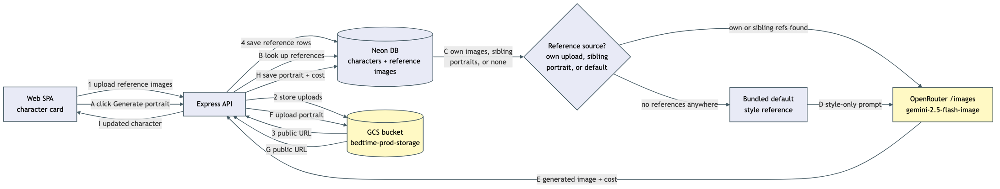

# Architecture: character base/portrait images

## What changes structurally

The API gains a new outbound integration (OpenRouter's dedicated image-generation endpoint, separate from the text-completion endpoint this app already talks to) and a new storage integration (Google Cloud Storage, provisioned since project inception but unused until now). Two new upload/generate flows sit alongside the existing character-bible CRUD: uploading baseline reference images (Web SPA to API to GCS to database, no AI call, no cost) and generating a portrait (Web SPA to API to database to OpenRouter to GCS to database, one billed AI call). The Cloud Run API's own identity gains write access to the storage bucket it already owned on paper but had no permission to touch.

## New infrastructure

- Cloud Run API service identity (`apiSa`) gets a bucket-scoped IAM binding (`roles/storage.objectAdmin` on `bedtime-prod-storage` only, not project-wide) — it currently has zero storage permission. This covers reading, writing, and deleting objects under both prefixes described below.
- Uploaded material and generated results are split by risk, not treated as one undifferentiated bucket of images — resolved by the product owner after this plan's first draft flagged it as open:
  - **Generated portraits** (AI art, no privacy sensitivity) live under a `portraits/` prefix and get a public-read IAM binding (`roles/storage.objectViewer` for `allUsers`), scoped with an IAM Condition so it applies to that prefix only — a plain HTTPS URL, reusable as an OpenRouter image reference for later generations with no re-download/re-encode step.
  - **Uploaded baseline reference images** (which, in this specific app, could plausibly be real photos of real family members) live under a separate `references/` prefix with *no* public grant at all. The only way to read one is a signed, time-limited URL the API mints on demand — for display in the UI, and for the one-time handoff to OpenRouter when a character's own references feed its portrait generation.
- A second, previously-unneeded IAM binding: `apiSa` is granted `roles/iam.serviceAccountTokenCreator` on itself. Minting a signed URL under Cloud Run's attached-identity credentials (no private key file present) goes through the IAM `signBlob` API, which requires a service account to be allowed to impersonate itself — without this binding, every signed-URL call fails outright, both for reference-image display and for the own-reference generation tier.
- No new compute, queue, or scheduled job — generation is a single synchronous request/response inside the existing "Generate portrait" button click, using the same request-timeout handling the app's text-generation calls already have.

## Data model evolution

- A new table holds one row per uploaded baseline/reference image, many-to-one against a character.
- A second new table holds one row per *generated* portrait, many-to-one against a character — this replaced an earlier draft of this plan that tracked only the current portrait as three columns directly on the character. The product owner asked for the previous portraits to be genuinely retained (not just relying on the storage bucket's version history), so each character now keeps one row marked current plus up to three prior rows; generating a new portrait flips the old current row to "previous" and, once more than three previous rows exist for that character, deletes the oldest of them. Each row also records which of the three fallback tiers produced it and which specific reference/sibling image URLs were fed in, so a person auditing a strange-looking portrait can see exactly what informed it, not just the tier name.
- The existing per-call cost-tracking table gains an optional character reference, alongside its existing optional story reference — a portrait-generation call is tied to a character, not a story, so it needs the same join capability text-generation calls already have via story.
- Deleting a character now also removes its reference-image rows, its portrait rows (current and previous), and its cost-tracking rows — mirroring how deleting a story already cascades through that story's own related rows elsewhere in this app. Without this, attaching even one image to a character would make that character permanently undeletable.

## Failure modes

- OpenRouter image call fails (timeout, HTTP error, provider rejects the reference count/size): nothing is billed by OpenRouter (image billing is documented as all-or-nothing — no partial charge on failure), the failed attempt is still recorded in the cost table with success=false for visibility, and no character row is touched. The button surfaces the error so the person can decide whether to retry.
- OpenRouter call succeeds but the follow-up upload to GCS or the database write fails: the call *was* billed. This is recorded as a successful cost row regardless of what happens next, and the character's portrait rows are not touched until the upload and both database writes (new current row, retention prune) all succeed — so a failure here surfaces as a distinct "generated but not saved, you were charged, please retry" state rather than a silent loss.
- The model the app asks OpenRouter to bill against isn't yet known to this app's own cost-tracking table (a one-time gap between a brand-new model appearing on OpenRouter and the nightly catalog sync picking it up): generation is refused *before* calling OpenRouter at all, with an explicit "model not recognized, run a catalog sync first" error — this is a deliberate cheap-check-before-expensive-call guard, because without it the OpenRouter call would still succeed and be billed, but recording its cost would fail silently (the existing cost recorder only logs a console error on a failed insert, it does not raise), which would hide real spending from the one place this app tracks it.
- A reference/portrait image URL a generation call depends on has been deleted from GCS out of band (bucket lifecycle, manual deletion): OpenRouter fetching that URL fails the call the same way any other upstream failure does; no special-cased handling needed beyond the generic failure path above.
- Double-click on "Generate portrait" before the first call returns: the button disables itself for the duration of the in-flight request, so a second click cannot fire a second billed call.

## Rollout

- The Pulumi IAM changes ship through this repo's existing CI "Infra" job (runs automatically on push to `main`, ahead of the Docker/Deploy job) — no manual `pulumi up`.
- The database migration runs via the existing `npm run db:migrate` script, applied the same way every prior migration in this repo has been.
- No environment variable is newly *required* for the app to boot: the GCS bucket name defaults to the real bucket's own name (`bedtime-prod-storage`), so nothing new needs to be added to Cloud Run's env vars or GitHub secrets for production. Local Docker dev needs Google Application Default Credentials available inside the container to exercise the upload/generate endpoints at all (see Documentation changes) — a one-time local setup step, not a blocker to the rest of the app running.
