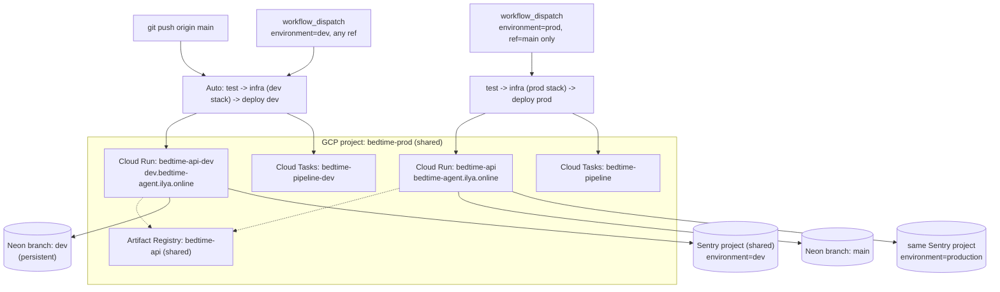

# Architecture: Dev deploy environment

## What changes structurally

**One GCP project (`bedtime-prod`) now hosts two Cloud Run services instead of one.** `bedtime-api`
(prod) is untouched. A new `bedtime-api-dev` service is added alongside it, sharing the project's
existing Artifact Registry repo, service accounts, enabled APIs, and Workload Identity Federation
setup. No new GCP project, no new billing link, no new WIF pool — the entire one-time bootstrap in
`docs/ci-cd/gcp-setup.md` (WIF pool, `github-ci` SA, owner-role grant) is reused as-is.

**`infra/index.ts` splits into a stack-gated foundation + per-stack environment resources.** Today
every resource in `index.ts` is declared unconditionally under the single `prod` stack. This changes
to: resources that must exist exactly once (the GCP project itself, enabled APIs, Artifact Registry,
the storage bucket, both service accounts, the CI SA's IAM bindings) are gated behind
`pulumi.getStack() === 'prod'` and continue to be owned by the `prod` stack only. A new `dev` Pulumi
stack (`Pulumi.dev.yaml`, same `gcp:project: bedtime-bootstrap` provider config as prod) declares only
the incremental per-environment resources — Cloud Run service `bedtime-api-dev`, its public invoker
binding, a `DomainMapping` for `dev.bedtime-agent.ilya.online`, and a Cloud Tasks queue
`bedtime-pipeline-dev` — referencing the foundation's known, static values (project id, region,
`bedtime-api@bedtime-prod.iam.gserviceaccount.com`, the registry URL) as plain config/constants rather
than Pulumi resource objects, since those are owned and lifecycle-managed by the `prod` stack. This
avoids two stacks ever fighting over ownership of the same underlying GCP project — the single most
important invariant here, since a `pulumi destroy --stack dev` must never be able to touch anything
the `prod` stack created.

**A new `APP_ENV` variable replaces `NODE_ENV` for observability tagging, without touching `NODE_ENV`
itself.** Planning surfaced that `NODE_ENV` is load-bearing in `server.ts` beyond just "is this a real
deploy": it also gates whether the built React SPA is served at all (`NODE_ENV === 'production'`),
whether auth cookies get the `Secure` flag, and whether the `DEV_API_KEY` local auth-bypass header is
even reachable. All three of those must stay in their current "production" state on **both** prod and
dev Cloud Run deployments — dev is a real, internet-reachable deployment, not local development. So
`NODE_ENV` stays `production` in both places, and a new `APP_ENV` (backend) / `VITE_APP_ENV` (frontend
build arg) env var is introduced purely for Sentry's `environment` tag and Langfuse's native
`environment` trace field. This is the one actual code change in this otherwise-infrastructural task —
three one-line edits: `packages/observability/src/sentry-node.ts`, `packages/observability/src/
langfuse-client.ts`, `packages/web/src/instrument.ts`.

**CI/CD trigger logic flips which environment is automatic.** Today, `push: [main]` deploys prod
directly, and `workflow_dispatch` can also deploy prod from any branch. Going forward: `push: [main]`
deploys **dev**; `workflow_dispatch` supports both `environment: dev` (any branch — this is how this
feature branch gets tested on the web before merging) and `environment: prod` (restricted to
`ref == 'main'` only, enforced in the workflow itself, not just documentation). This is the one
behavioral change to the pipeline's trigger semantics, not just an additive one — worth calling out
since `docs/ci-cd/README.md` currently documents the opposite ("push to main = prod").

## New infrastructure

- **Cloud Run service** `bedtime-api-dev` (`us-central1`, same 512Mi/1CPU/maxScale-2 shape as prod,
  scale-to-zero, `--allow-unauthenticated` — protected by the app's own login like prod, not by IAM).
- **Cloud Run DomainMapping** `dev.bedtime-agent.ilya.online` -> `bedtime-api-dev`.
- **Route53 CNAME** for `dev.bedtime-agent.ilya.online` -> `ghs.googlehosted.com`, in the existing
  `ilya.online` hosted zone. Created the same way prod's was — outside Pulumi, as a one-time manual
  step (matching this repo's existing precedent; prod's own DNS record isn't Pulumi-managed either).
  No new AWS cost: the hosted zone's flat monthly fee already covers additional records.
- **Cloud Tasks queue** `bedtime-pipeline-dev` — separate from prod's queue so dev's story-generation
  dispatch never competes with or blocks prod's.
- **Two Cloud Scheduler jobs mirrored into dev**: `catalog-sync-dev`, `universe-memory-sync-dev`,
  pointed at the dev URL with their own header secrets (full parity with prod, per your choice).
- **New Pulumi stack**: `dev`, in the same `infra/` Pulumi program, same GCS state backend
  (`gs://bedtime-pulumi-state`), different stack name so state doesn't collide with `prod`.
- **New GitHub environment**: `dev`, with its own variables/secrets, mirroring how `prod` is
  configured today (`Settings -> Environments -> dev`).
- **New Neon branch**: `dev`, persistent (no TTL), branched from `main` at plan time — distinct from
  the disposable, TTL'd per-feature branches (`interactive-story-chat-dev`, etc.) already used for
  local development.
- **Fresh, dev-scoped third-party credentials**: a new OpenRouter API key, and a new Google OAuth
  client (client ID + secret) with `https://dev.bedtime-agent.ilya.online/api/auth/google/callback`
  registered as its redirect URI. Sentry and Langfuse are *not* new — see below.

## What is explicitly reused, not duplicated

- **Sentry project and Langfuse project** — same DSN, same auth token, same Langfuse keys as prod.
  Distinguished only by the new `APP_ENV`/`VITE_APP_ENV`-driven `environment` tag. This matches
  Sentry's own documented guidance: projects separate services/apps, environments separate deploy
  stages within one project (docs.sentry.io/concepts/key-terms/environments).
- **Artifact Registry repo** (`bedtime-api`) — dev and prod images both land here, distinguished by
  tag (`api:<sha>`), same as how prod already works.
- **`github-ci` service account and its WIF binding** — already has `roles/run.admin` at the project
  level, which covers deploying to `bedtime-api-dev` with no new IAM grant needed.
- **`bedtime-api` runtime service account** — reused as the Cloud Run runtime identity for
  `bedtime-api-dev` too. Its existing `roles/cloudtasks.enqueuer` grant is project-scoped, so it
  already covers the new dev queue with no additional binding.
- **GCS storage bucket** (`bedtime-prod-storage`) — not yet functionally used by the app either way;
  no dev-specific bucket created.

## Data model evolution

Not applicable to the schema itself. Operationally: the new Neon `dev` branch starts as whatever
`main`'s schema looked like at creation time, and from then on gets its own migrations applied by its
own deploy job (`npm run db:migrate` against `DEV_DATABASE_URL`), exactly mirroring how prod's deploy
job already works — the two branches evolve independently after the initial branch point.

## Failure modes

- **A dev-stack `pulumi up`/`destroy` accidentally touching prod-owned resources** — the single
  highest-stakes risk in this design. Mitigated structurally: the `dev` stack's Pulumi program never
  declares the project, APIs, registry, bucket, or service accounts as resources it owns — those exist
  only in the `prod` stack's state. `pulumi destroy --stack dev` can only ever remove what stack `dev`
  itself created.
- **Prod accidentally receiving an untested feature branch** — closed by restricting `workflow_dispatch`
  with `environment: prod` to `ref == 'main'` in the workflow file itself (a real gate, not just a
  documented convention).
- **Dev silently missing the SPA / leaking the dev-auth-bypass header** — closed by keeping `NODE_ENV`
  as `production` in both deployed environments; see "What changes structurally" above.
- **Dev and prod Cloud Tasks work interleaving** — closed by giving dev its own queue.
- **Stale short-lived Neon branches being mistaken for the real dev database** — the persistent `dev`
  branch is a distinct, explicitly non-expiring branch; the existing TTL'd per-feature branches
  (`*-dev`, `*-verify`) are left exactly as they are for local development use.

## Rollout

Single-direction rollout, no feature flag: this only changes deploy topology, not app behavior. Order:
1. Provision the Neon `dev` branch and fresh third-party credentials (OpenRouter key, Google OAuth
   client) — see `todo.md` for what needs you specifically.
2. Restructure `infra/index.ts` (stack-gated foundation), add `Pulumi.dev.yaml`, run `pulumi stack init
   dev` and a first `pulumi up --stack dev` to create the incremental resources.
3. One-time manual Route53 CNAME for the dev subdomain; wait for the managed cert.
4. Make the three `APP_ENV`/`VITE_APP_ENV` observability edits.
5. Rewrite `.github/workflows/deploy.yml` trigger logic and `docs/ci-cd/README.md` /
   `docs/ci-cd/gcp-setup.md` to match the new topology.
6. Create the GitHub `dev` environment with its variables/secrets.
7. First deploy: manually dispatch `environment=dev` from this feature branch to verify the whole
   pipeline before merging — this is the actual point of this task.
