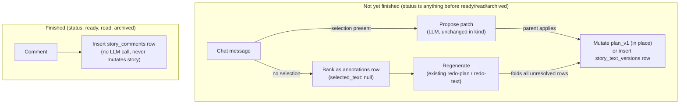

# Architecture: Story chat comments

## What changes structurally

Today there are two disconnected mechanisms and one gap:

1. **Plan-only chat+patch.** `pipeline-questions.ts`'s conversation endpoint plus `apply-plan-patch` — a single passage gets rewritten immediately. Scoped to the plan phase, never persists a "banked" record when no passage is selected (a message with no selection is just freeform Q&A today, not a stored comment).
2. **Highlight+bank+regenerate, per phase.** The `annotations` table plus `redo-plan`/`redo-text` — a highlighted passage plus a note accumulates until an explicit regenerate folds every unresolved item into one pass. Requires a highlighted span today (`selected_text` is `NOT NULL`); has no path for "a comment about the story as a whole."
3. **Comments on a finished story.** No mechanism at all — the reader page happens to let annotations get created against `ready`/`read` stories via the same handler used during proofreading, but nothing ever consumes them; they sit forgotten. This is incidental, not designed.

This work unifies the entry point (one chat-style surface, reachable from the plan, text-review, and reader pages) while keeping each phase's actual mutation mechanism where it already lives and fits:

- The **plan/text conversation endpoint generalizes** to operate against either the plan or the current active text version, decided by a `context` parameter, and gains a new responsibility: when a message carries no selection, it now banks the comment (as an `annotations` row) instead of only logging freeform chat. When a message carries a selection, behavior is unchanged in kind — propose a patch, apply on confirmation — except that a text-phase patch now lands as a new `story_text_versions` row (immutable-version pattern, matching how text already works) rather than a plan-style in-place field mutation.
- The **`annotations` table's `selected_text` becomes nullable**, so it can represent both "note about this specific highlighted span" (existing) and "note about the story as a whole" (new). Everything that reads `annotations.selectedText` as a guaranteed string — the two `formatAnnotationsAsFeedback` helpers and `annotation-resolver.ts` — is updated to format a null selection as a general comment rather than a fragment quote.
- A **new table, `story_comments`, is introduced** for the one genuinely new case: a comment on a `ready`/`read`/`archived` story. It is deliberately kept separate from `annotations` because `annotations` rows get consumed (resolved or deleted) by the regenerate flows — a table that a future universe-memory sync will read from must never have rows disappear out from under it. `story_comments` denormalizes `universe_id` at write time (copied from the story's `group_id`) so a later sync pass can query "all comments for universe X" without joining through `stories`.
- **`plan_conversations` keeps its current name** and gains a `context` column (`'plan' | 'text'`, default `'plan'` for existing rows) — it becomes the conversation transcript for both editable phases without a rename. A rename was considered and rejected: see "Decisions made autonomously" in `spec.md` for why.
- **The mutate-vs-record boundary is "has the story reached a finished state," not "is the story in one specific status."** `apply-plan-patch` today reads `planV1 ?? planFinal` with no status check at all — `planFinal` gets populated at plan approval while the story can still be mid-transition before text generation flips `status` to `proofreading`, and legacy stories can carry a populated `planFinal` outside the normal flow entirely. Gating plan/text mutation to an exact status (`draft` only, or `proofreading` only) would reject calls the existing, currently-ungated code already serves. Instead, the new gate only distinguishes: `status` in (`ready`, `read`, `archived`) → record-only (the new `story_comments` path); anything else → mutation allowed (chat patch or banking), matching how loosely the current code already treats the pre-finished lifecycle.

## New infrastructure

None. No new external services, queues, or cloud resources.

## Data model evolution

- `annotations.selected_text`: `NOT NULL` → nullable. `position_start`/`position_end` become meaningless (and should be omitted) when `selected_text` is null — no schema-level CHECK constraint is added for this pairing; it is enforced at the API validation layer to keep the migration simple. Existing rows are unaffected (all have `selected_text` populated already).
- `plan_conversations` (name unchanged) gains a `context` column (`text`, `$type<'plan' | 'text'>()`, `notNull().default('plan')`). Existing rows all default to `'plan'`, which is correct — they are all plan-phase conversation turns. This is a pure additive column, no rename — see "Decisions made autonomously" in `spec.md`.
- New table `story_comments`: `id`, `story_id` (FK → stories, not null), `universe_id` (FK → story_groups, nullable — a legacy story might have no group), `comment_text` (not null), `selected_text` (nullable — captured for context even though it's never actionable), `created_at`. No `resolved_at`/consumption semantics — rows here are permanent history, by design.
- `story_text_versions.stage` gains a new literal, `'chat_patch'`, alongside the existing `'writer_initial' | 'writer_critic' | 'annotated_rewrite'`, to distinguish a single chat-driven passage patch from a full annotated-rewrite pass in any future analysis of version history.

## Failure modes

- **Patch drift** (plan or text changed between propose and apply): both `apply-plan-patch` (existing) and the new `apply-text-patch` reject with 422 rather than silently no-op-ing or corrupting content. No change to this existing safeguard; the new endpoint mirrors it exactly.
- **Mutation attempts on a finished story**: any chat/patch/bank call (`context='plan'` or `context='text'`) against a story whose `status` is `ready`, `read`, or `archived` is rejected (409) rather than silently doing nothing or writing an annotation that will never be consumed. This closes the identified gap where annotations could previously be created against `ready`/`read` stories and then sit forgotten — it does **not** add any new restriction to the pre-finished lifecycle, where the existing plan-patch flow already runs without a status check.
- **Null-selection annotations reaching old code paths**: the two `formatAnnotationsAsFeedback` copies and `annotation-resolver.ts` are updated together with the schema change — a null selection must never reach a `` `«${selectedText}»` `` string-template unguarded, since that would literally print "«null»" into a prompt sent to the model.

## Rollout

Single deploy, no phased rollout or feature flag needed — every schema change is additive (new table, new nullable column, new `context` column with a safe default, new `stage` union literal). No rename, no backfill, no data deletion, no destructive schema change — safe to run unattended via the standard `npm run db:migrate` path.
