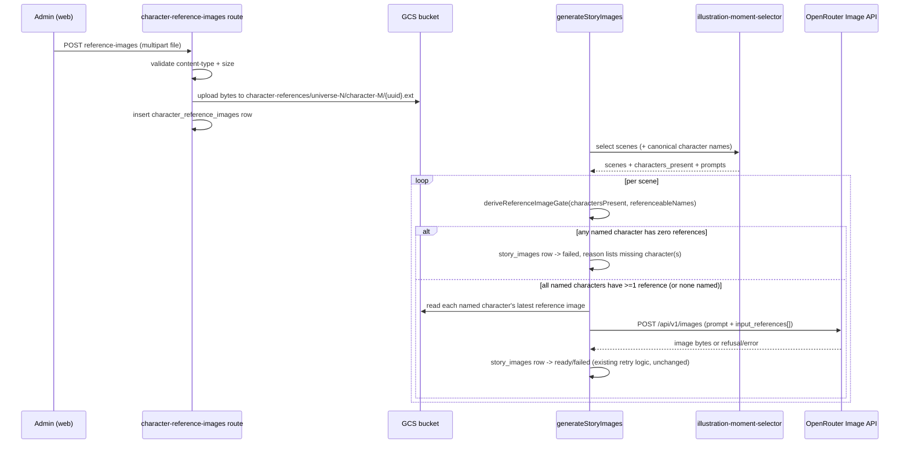

# Architecture: Character reference images for story illustrations

## What changes structurally

**Character consistency ownership moves from the pipeline to the admin.** In the already-built `story-images` feature (commit `fa658bb`, unmerged), `story_groups.reference_image_path` was auto-set from the first successful generation in a universe and silently reused for every later generation — an emergent, unreviewed "canonical look" nobody chose. This plan replaces that entirely: a new `character_reference_images` table holds admin-uploaded images, one row per image, many rows per character. Nothing is ever auto-populated into it; it only changes when a human uploads or deletes through the new admin UI.

**A new pre-generation gate becomes a hard dependency of the illustration pipeline.** Today, `generateStoryImages` (`packages/api/src/routes/story-images.ts`) goes straight from scene selection to calling the paid image API for every scene. This plan inserts a mandatory check between those two steps: for every scene, every character name the scene-picker LLM identified must resolve (via normalized name matching) to a `universe_characters` row that itself has at least one `character_reference_images` row. A scene that fails this check never reaches `OpenRouterClient.generateImage()` — it is written straight to `story_images` as `failed`, the same isolated-per-scene failure shape already used for content-moderation refusals, so one ungated scene never blocks the story's other scenes.

**The scene-picker prompt gains grounding context it didn't have before.** `selectIllustrationMoments` currently only sees the story's final text. To make the gate's name-matching reliable (Russian name declensions mean a character can appear as "Гошу"/"Гоше" in prose while the canonical bible name is "Гоша"), the stage now also receives the universe's canonical character names and is instructed to use them verbatim in `characters_present` when referring to those characters. Matching itself is additionally hardened with trim + case-insensitive normalization (shared between the new gate and the existing character-description filter in `story-images.ts`), rather than pure exact string equality.

**The OpenRouter image request moves from "at most one reference image" to "one reference image per named character."** `OpenRouterClient.generateImage()`'s `ImageGenerationRequest` currently accepts a single optional `referenceImageBase64`/`referenceImageMediaType` pair (the old universe-wide canonical image). It changes to accept an array of reference images, one per character present in the scene (each character's most recently uploaded image, chosen deterministically by `uploadedAt DESC`), assembled into OpenRouter's `input_references` array — confirmed as the correct wire shape for multi-image input (see "External API contract" below).

## New infrastructure

None. Reuses the existing `bedtime-prod-storage` GCS bucket and the `api-sa` service account's already-granted `storage.objectAdmin` binding (from the `story-images` plan) — no new bucket, no new IAM binding. The new object path prefix (`character-references/...`) lives inside the same bucket alongside the existing `story-images/...` prefix.

## Data model evolution

**New table `character_reference_images`:**

| Column | Type | Notes |
|---|---|---|
| `id` | serial PK | |
| `character_id` | integer, FK → `universe_characters.id`, not null | plain FK, no cascade — matches this schema's existing convention of zero `onDelete` cascades; cleanup is explicit application-level code in the character-delete route (Scenario 11) |
| `gcs_path` | text, not null | `character-references/universe-{universeId}/character-{characterId}/{uuid}.{ext}` — never derived from character name or client filename |
| `uploaded_at` | timestamp, default now, not null | |

No `content_type` column — served bytes reuse the exact same pattern as `readImage()` in `gcs-images.ts`, which already reads content type back from GCS object metadata rather than duplicating it in Postgres.

**`story_groups.reference_image_path` is dropped.** It existed solely to support the removed auto-bootstrap mechanism; nothing else ever read it.

**`story_images.reference_image_used` is kept, meaning is redefined.** Previously: "the universe's one auto-bootstrapped canonical image was passed as input." Now: "at least one uploaded character reference image was attached as input for this generation" (i.e., `true` whenever the scene named at least one character and the gate passed; `false` for an ungated establishing-shot scene with no named characters). No column type change, no migration needed for this one — only its application-level meaning changes.

**`universe_characters` is unchanged** — `character_reference_images.character_id` is the only new link into it.

## Failure modes

- **Gate failure (new)** — a named character has zero reference images. Handled synchronously before any network call: the scene's `story_images` row goes straight to `status = 'failed'`, `failure_reason = 'no reference image for character: <name[, name...]>'`. No retry — this is a data-completeness problem, not a transient one; retrying without new data would fail identically.
- **Upload validation failure (new)** — non-image content-type or oversized file. Rejected at the multipart-parsing layer (`multer` `fileFilter` + `limits.fileSize`) before any GCS write; the request never reaches the database or storage.
- **GCS delete failure during character deletion (new)** — best-effort; logged, does not block the character row deletion (matches the existing tolerance pattern for storage-layer hiccups already present in `generateSingleImage`'s upload-failure handling).
- **All other image-generation failure modes are unchanged** — moderation refusal, transient retry/exhaustion, terminal API error, storage-upload-after-success error. These still apply only to scenes that passed the gate and actually called the API.

## Rollout

This entire branch (`story-images`, commit `fa658bb` plus this plan's additions) is unmerged — migration `0044` that created `story_groups.reference_image_path` has never reached `main` or production (confirmed: `main`'s highest migration is `0043`; `0044` exists only on this feature branch). Dropping that column is therefore a same-branch schema correction, not a production rollback — no data migration or backward-compatibility shim is needed. This plan's own migration runs against a freshly requested disposable Neon branch (the current worktree's `story-images-verify` branch expires imminently and must not be reused for building), same as the original `story-images` plan's Implementation Order step 0.

## External API contract — OpenRouter multi-image reference input

Confirmed via OpenRouter's Image Generation documentation (`https://openrouter.ai/docs/features/multimodal/image-generation`, fetched 2026-07-22): multiple reference images are passed as a top-level `input_references` array, each entry shaped `{ "type": "image_url", "image_url": { "url": "<https URL or base64 data URL>" } }`. This is the same field the existing `generateImage()` already uses for its single optional reference image — the change is purely "always build the array from N characters' images instead of at most one universe-wide image," not a new wire format. Per-model reference-image count limits vary by provider (OpenRouter's docs note ranges like 4–16 depending on the model); at most 3 characters can appear in a scene in practice (illustration-moment-selector caps scenes at 3 total, and a single scene rarely names more than 2-3 named characters), so no explicit cap is needed for `google/gemini-2.5-flash-image`.
