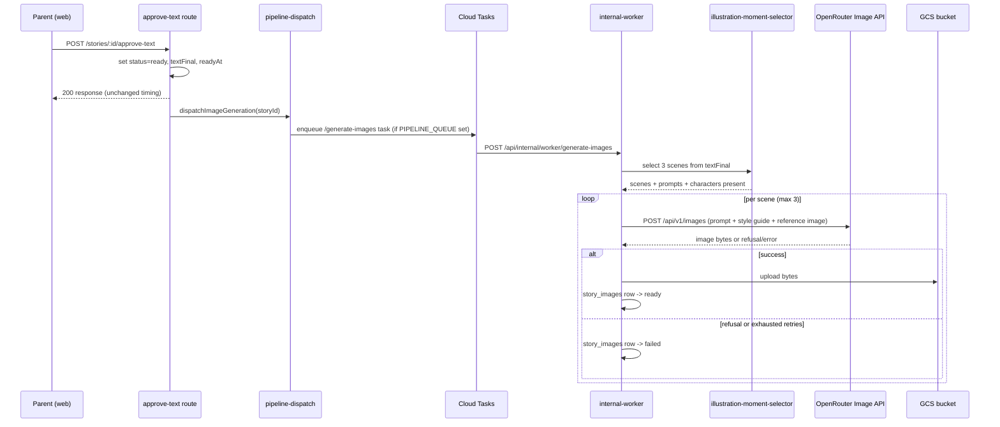

# Architecture: Story illustration generation

## What changes structurally

Approving a story's text gains a second, fully independent background fan-out alongside the existing analysis dispatch: illustration generation. It follows the exact same dispatch shape already established for `dispatchAnalysis` — Cloud Tasks queue when configured, in-process fallback otherwise, secret-header-protected internal worker route, failures caught and logged at the call site, never propagated to the approval response.

Inside that background job, three new pieces of logic run in sequence for a given story:
1. **Illustration-moment selection** — a new structured LLM pipeline stage (same shape as `runStoryAnalyzer`/`runUniverseFactExtractor`, running through `aiRunner.runStructured`) that reads the approved text and returns up to 3 scenes, each with a scene description, the characters present, and an image-ready prompt.
2. **Image generation** — a new call path (not `aiRunner`, since its request/response shape is images, not JSON text) through a new `generateImage()` method on `OpenRouterClient`, hitting OpenRouter's dedicated Unified Image API (`POST /api/v1/images`, not `/chat/completions`), optionally passing the universe's canonical reference image for image-to-image conditioning.
3. **Storage** — successful image bytes are uploaded to the existing `bedtime-prod-storage` GCS bucket and the corresponding `story_images` row is marked `ready` with its GCS path; the frontend never talks to GCS directly, only to a new authenticated API route that proxies the bytes.

## New infrastructure

- **IAM**: a new `gcp.storage.BucketIAMMember` in `infra/index.ts` granting the existing `api-sa` service account object read/write scoped to `bedtime-prod-storage` only (not project-wide `roles/storage.admin`, which today only `ciSa` holds for deploy purposes).
- **No new Cloud Tasks queue** — the existing `bedtime-pipeline` queue (`maxConcurrentDispatches: 3`, 5 retries) is reused for the new `/generate-images` task type, same as `/analyze` reuses it today.
- **No new Cloud Scheduler job** for the steady-state feature — image generation is triggered by approval, not on a schedule. The one-time backfill (Scenario 9) is invoked manually via an authenticated internal endpoint, not scheduled.
- **New env var**: `GCS_BUCKET_NAME`, added to `packages/core/src/env.ts`'s Zod schema as optional (so local dev without GCS configured degrades to "image generation skipped, logged" rather than crashing on startup), sourced from the Pulumi `bucketName` output and wired into Cloud Run env vars via the GitHub Actions deploy step, same mechanism already used for `DATABASE_URL`/`JWT_SECRET`/etc.
- **New npm dependency**: `@google-cloud/storage` in `packages/core` (the only GCP SDK currently installed anywhere in the monorepo is `@google-cloud/tasks`, used for Cloud Tasks).

## Data model evolution

**`story_groups`** gains two new nullable text columns (parallel to the existing `style_guide*` columns):
- `visual_style_guide` — free-text description of the universe's illustration style (palette, line style, mood), the image-generation analog of `styleGuide`.
- `reference_image_path` — GCS path of the one canonical reference image reused as image-to-image input for every generation in this universe. Null until the first successful generation sets it; never overwritten automatically afterward (manual replacement is a future admin feature, out of scope for v1).

**`universe_characters`** gains one new nullable text column:
- `visual_description` — how this character looks, folded into the prompt for any scene that includes them. Separate from the existing free-text `description`/`traits` (which are narrative/personality facts, not visual ones).

**New table `story_images`** — one row per illustration slot per story (current-state table, in the shape of `story_text_versions`, not an attempt-by-attempt log — that log already exists generically via `model_calls`):

| Column | Type | Notes |
|---|---|---|
| `id` | serial PK | |
| `story_id` | integer FK → `stories.id`, not null | |
| `universe_id` | integer FK → `story_groups.id`, nullable | denormalized for convenient querying; null if the story has no group |
| `sequence_index` | integer, not null | 0, 1, 2 — display order; unique together with `story_id` |
| `scene_description` | text, not null | from the moment-selector stage |
| `prompt_used` | text, not null | the exact prompt sent to the image model |
| `model_id` | text FK → `model_catalog.id` | which model actually produced the ready image (primary or fallback) |
| `status` | text enum: `pending`/`generating`/`ready`/`failed`, default `pending`, not null | |
| `failure_reason` | text, nullable | e.g. `moderation_refused`, `api_error`, `retries_exhausted` |
| `gcs_path` | text, nullable | set only when `status = ready` |
| `reference_image_used` | boolean, default false, not null | whether the universe's canonical reference image was passed as image-to-image input for this generation |
| `attempt` | integer, default 1, not null | current attempt count for this slot; capped at 3 (Scenario 8) |
| `created_at` | timestamp, default now | |
| `updated_at` | timestamp, default now | |

Unique constraint on `(story_id, sequence_index)` — a re-run of the worker updates the existing row for that slot rather than creating a duplicate (Scenario 8).

**No new audit/cost table.** Every image generation attempt (success or failure) is recorded through the existing generic `costRecorder.record()` → `model_calls` path already used by every other pipeline stage, with `stage: 'illustration_image'`. `model_calls.storyId` + `stage` is sufficient to reconstruct per-story, per-attempt cost history — this is the same convention `story_analyzer`/`plotter`/etc already use, so no new reporting code is needed to see illustration cost in existing dashboards.

**`model_catalog.image_usd_per_request` is not a reliable source for real per-image cost and must not be used for it.** Verified by reading `openrouter-catalog-fetcher.ts`: this column is populated only from the upstream `pricing.image` field (the per-token cost of an *input* reference image), copied in as-is with no multiplication by token count. For `google/gemini-2.5-flash-image`, that upstream field is `0.0000003` — the real per-generated-image cost is driven by the separate `pricing.image_output` field (`0.00003`/token × ~1290 tokens ≈ `$0.039`/image), which the existing catalog sync does not capture at all. This is a pre-existing data-quality gap in the catalog sync, out of scope to fix here. Consequently, per-generation cost in this feature is recorded the same way every other stage already records cost: from the actual `usd` value the OpenRouter response returns for that specific call, via `costRecorder.record()` — never read back from `model_catalog`.

## Failure modes

- **Image API network/5xx/timeout error** → retryable, same `isRetryable()` classification already used by `openrouter.runner.ts`, up to the per-slot attempt cap (3 total attempts), then `failed` with `failureReason: 'api_error'`.
- **Content moderation refusal** → NOT retried (retrying a refusal wastes money on a result that won't change); `failed` immediately with `failureReason: 'moderation_refused'`. Distinguishing a refusal response from a hard error is confirmed against the live API in the first implementation step (todo.md item 1), since it shapes this classification logic.
- **Moment-selector stage fails entirely** (e.g. invalid JSON after all retries, same failure mode `runStoryAnalyzer` already has) → no `story_images` rows are created for this story; logged and swallowed at the same isolation boundary, story approval and reading are unaffected. This is a whole-story skip, not a partial failure — acceptable because illustrations are a value-add, not a blocking requirement.
- **GCS upload fails after successful generation** → the row stays `generating`/is retried up to the same attempt cap, then `failed` with `failureReason: 'storage_error'` — money was already spent generating the image, but the row still correctly reflects "not usable," and the frontend never surfaces a broken image link.
- **Cloud Tasks delivery failure** (transport-level, e.g. worker URL unreachable) → handled entirely by the existing queue's own retry config (5 attempts, exponential backoff); this is orthogonal to and does not interact with the per-slot generation attempt cap, which only counts actual model-call attempts once the worker request is received.
- **Backfill invoked twice / worker retried by the queue** → idempotent via the `(story_id, sequence_index)` unique constraint — re-running updates existing rows in place instead of creating duplicate cost.

## Rollout

1. Migration adds `story_images` table plus the new nullable columns on `story_groups`/`universe_characters` — purely additive, no backfill of existing rows required by the migration itself (existing stories simply have zero `story_images` rows until the separate backfill endpoint is invoked).
2. Infra change (IAM binding + env var) ships via the normal Pulumi `pulumi up` step, independent of the app deploy — the app code tolerates `GCS_BUCKET_NAME` being unset (image generation logs and no-ops rather than crashing), so ordering between infra and app deploy is not sensitive.
3. New code path is triggered automatically for every story approved after deploy — no feature flag, since failure is already fully isolated from the existing approval flow per Scenario 6.
4. The one-time backfill for ~100 existing approved stories (Scenario 9) is invoked manually, once, after confirming the steady-state path works correctly on a handful of newly-approved stories.
