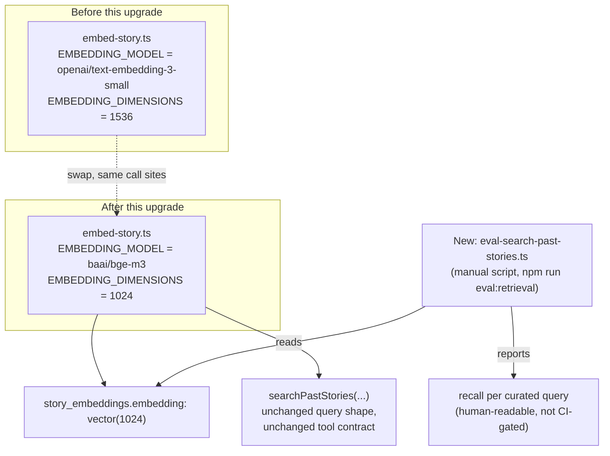

# Architecture: Story retrieval RAG upgrade

## What changes structurally

The original #297 build (`.planning/unassigned/story-retrieval/`, already merged into this branch's
history) added a `story_embeddings` table, a `search_past_stories` tool wired into the plotter, and a
bounded tool-calling loop in the OpenRouter runner. This upgrade does not change any of that
structure. It changes one data contract (the embedding model and its output dimension) and adds one
new, manually-triggered evaluation script. No new service, no new async boundary, no new ownership.

## Why this is a swap, not a redesign

This upgrade evaluated six standard RAG techniques against this app's real, current data (see
"Investigation summary" below) and found only one worth changing: the embedding model. The
retrieval mechanism, the storage shape, the tool contract, the plotter wiring, and the bounded
tool-calling loop are all unchanged — they were already evidenced as correct for this app's scale
in the original build and remain correct here.

## Investigation summary — six RAG techniques evaluated against real data

1. **Chunking (embed story fragments instead of whole stories) — no change.** Direct retrieval
   tests against the real ~60-100-story universe-1 corpus showed whole-story embeddings correctly
   surfacing the right story for realistic thematic queries: a "found money on the street" query
   top-ranked the one story literally about finding money on the ground; a "scared of the dark"
   query top-ranked a story that opens with the power going out. At 800-1200 words per story,
   whole-story embedding is not blurring the signal enough to matter. One embedding per story
   remains correct.

2. **Re-ranking (a second LLM/cross-encoder pass over the top candidates) — no change.** The
   plotter's tool already returns full story *text* for the top 5 candidates, not just titles or
   scores — the same model call that decides whether to use a callback also reads the actual
   content and judges relevance itself. That is already an implicit reranking step, done for free
   inside the same call. A dedicated reranking call would double cost and latency per tool
   invocation with no concrete precision problem in evidence to justify it, at a corpus size
   (67-100 rows) where the entire candidate pool already fits in one non-streaming request.

3. **Hybrid search (keyword/character-name matching combined with vector search) — no change,**
   after correcting an initial wrong hypothesis. `universe_characters` does hold structured,
   recurring character names (Гоша, Мира, Артём, Максим, etc.), and a first, narrow test seemed to
   support hybrid search: a naive top-10-by-cosine query for "история с Максимом" surfaced only 3-4
   of the 28 stories that literally mention that character (checked via `ILIKE '%Максим%'`). But
   re-running the same query at top-15 recall showed 14 of 15 results *were* stories that mention
   that character — the narrow top-10 sample was misleading, not a real precision gap. Embeddings
   already pick up character-name co-occurrence well, because names are salient literal tokens in
   the story text the model embeds directly. Adding a keyword-matching layer would add real code
   (name extraction, a second query path, a merge/boost strategy) to fix a gap the corrected,
   larger-sample test does not show exists.

4. **Retrieval evaluation harness — added,** as a manually-triggered script (`SCENARIO 2`), not a
   CI-gated test. There was previously no repeatable way to detect a retrieval-quality regression
   from a future embedding-model or prompt change; the one-off proof from the original build (a
   story matching itself at distance zero) only proves vectors are populated, not that they're
   *useful*. CI cannot run this: the `test` job in `.github/workflows/deploy.yml` has no
   `DATABASE_URL` or `OPENROUTER_API_KEY` (only the `deploy` step receives secrets), and adding
   either to the test job to support one eval script is a real, unjustified cost/security surface
   increase for what is a manually-triggered developer check.

5. **Multi-query / query expansion (the tool trying several phrasings per call) — no change.**
   Nothing in the real retrieval tests showed a single, model-composed query underperforming
   because of phrasing — the plotter already composes one query from its own reasoning about the
   outline, and query expansion would multiply embedding-API calls and tool-loop latency for a
   benefit that has not been demonstrated as missing. Revisit only if the new eval harness
   (point 4) surfaces a systematic recall problem traceable to single-query phrasing.

6. **Embedding model choice — changed,** from `openai/text-embedding-3-small` (1536-dim, $0.02/M
   input tokens on OpenRouter, English-optimized) to `baai/bge-m3` (1024-dim, $0.01/M input tokens
   on OpenRouter, genuinely multilingual-tuned — OpenRouter's own model-launch announcement
   specifically recommends `bge-m3` for cross-language use). This is not a benchmark-only claim: I
   directly embedded the real universe-1 corpus (96 stories) with both models and ran the same 3
   real Russian queries against each. For "история с Максимом" (a story about the character
   Maxim), `bge-m3` ranked story 42, "Мир Максима" — the one story that literally opens "Меня зовут
   Максим" and is actually *about* Maxim as protagonist — at #1; `text-embedding-3-small`'s top 3
   were all stories where Maxim is a supporting character, not the best match. For a
   "scared of the dark" query, `bge-m3` ranked story 108, which opens "Бах — и темно" (the lights
   go out, a child's fear reaction), at #1; `text-embedding-3-small` ranked that same story outside
   its own top 10 entirely. Migration cost is effectively zero: this feature has never been
   backfilled in production (the migration and backfill only exist on this unmerged branch), so
   changing the model and the vector dimension now, before the first production backfill ever
   runs, requires no re-embedding of existing rows — there are none yet.

## New infrastructure

None. No new service, no new secret, no new endpoint, no IaC change. This upgrade only changes a
model identifier, a column's declared dimension, and adds one manually-run script under the
existing `packages/core/src/scripts/` convention (matching `notion-import.ts`, `create-user.ts`).

## Data model evolution

`story_embeddings.embedding` changes from `vector(1536)` to `vector(1024)`. Because this table has
never existed in production or any shared environment — it was introduced by the original #297
build on this same unmerged branch, and no backfill has ever run against production — the existing
hand-authored migration `0044_story_embeddings.sql` is edited in place rather than superseded by a
new migration file. Editing an unreleased migration is the correct call here specifically because
nothing outside this branch (and disposable, expiring verify branches used only for this planning
session) has ever applied it; the moment a migration has shipped to a shared or production
database, this same reasoning would require a new migration instead, matching this repo's normal
practice for every other schema change.

`story_embeddings.embedding_model`'s column default changes from `'openai/text-embedding-3-small'`
to `'baai/bge-m3'` — this column already existed specifically "so a future model change is visible
in the data itself" (original plan's own reasoning); this upgrade is the first real use of that
design intent, not a new mechanism.

No changes to `stories`, `story_groups`, or `universe_characters`.

## Failure modes

- **A future embeddings-API response's vector length doesn't match `EMBEDDING_DIMENSIONS`
  (now 1024):** the existing dimension-mismatch check in `embedStoriesBatch` already throws and
  reports the story in the batch's `failed` list rather than silently storing a malformed vector —
  unchanged behavior, now guarding the new dimension instead of the old one (SCENARIO 4).
- **`baai/bge-m3` becomes unavailable or is deprecated on OpenRouter:** the `embedding_model` column
  already records which model produced each row, so a future rollback or re-embed to a different
  model is a contained, traceable operation — the same safety property the original plan built this
  column for, now actually exercised.
- **The eval harness's curated story IDs get deleted or rewritten over time:** a documented,
  accepted maintenance cost, not a blocker — the harness is a manually-run developer tool, and a
  broken fixture surfaces immediately as an obviously-wrong result (a missing story ID) rather than
  a silent false pass.

## Rollout

Additive from production's perspective: production has no `story_embeddings` rows and no
deployed backfill yet, so this upgrade ships as part of the *same*, still-unreleased #297 feature —
there is no separate migration-then-backfill sequencing to coordinate, no dual-write period, and no
existing embedded data to reconcile. The manual steps already documented in the original plan's
`todo.md` (create `PROD_EMBEDDING_BACKFILL_SECRET`, trigger the backfill once after deploy) are
unchanged except that the backfill now produces 1024-dim `bge-m3` vectors instead of 1536-dim
`text-embedding-3-small` ones.
</content>
