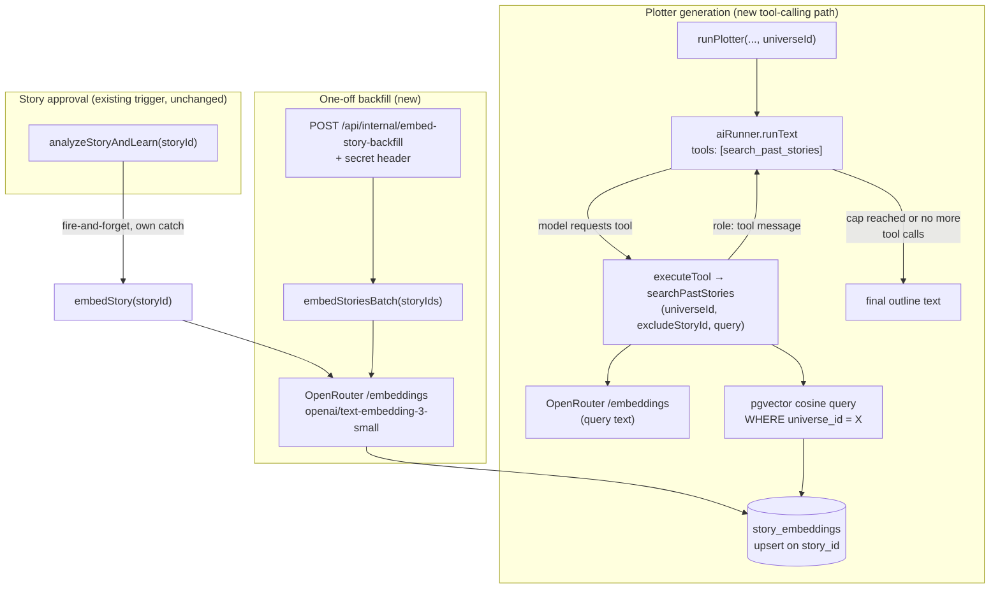

# Architecture: Story retrieval (vector search + tool-calling)

## What changes structurally

Today every piece of context the plotter/writer sees is decided entirely by the orchestrator
*before* the prompt is built — `loadMemorableMoments`, the universe style guide, character bible
entries, all pre-fetched via plain SQL and concatenated into the prompt string. The model itself
never decides to look anything up. This feature adds a second, model-initiated retrieval path
alongside that existing pre-fetch path, without replacing it:

1. **A new storage layer** (`story_embeddings`, pgvector on Neon) holds one vector per story,
   populated automatically at the same point `analyzeStoryAndLearn` already runs today (story
   approval), plus backfilled once for the 67 existing `read` stories via a new one-off internal
   endpoint.
2. **A new capability in the OpenRouter runner** (`packages/core/src/openrouter/`): `runText` gains
   an optional bounded tool-calling mode. When a caller passes `tools` + `executeTool`, the runner
   stops using its normal single-shot streaming call and instead runs a capped loop of
   non-streaming calls, executing any tool the model requests and feeding results back as
   `role: 'tool'` messages, until the model stops calling tools or a hard iteration cap is hit.
   Callers that don't pass `tools` see no behavior change at all — the existing streaming path is
   untouched.
3. **One new tool, `search_past_stories`**, wired into the **plotter only** (not the writer — see
   "Decisions made autonomously" in `spec.md`). When the plotter has a resolved `universeId`, it is
   offered this tool; if it calls it, the runner executes a pgvector cosine-similarity query
   scoped to that universe and hands the results back as tool output.

## New infrastructure

- **pgvector extension on Neon** (`CREATE EXTENSION IF NOT EXISTS vector`) — confirmed available
  natively on Neon's Postgres 17. No new managed service; this is a Postgres extension, enabled via
  migration like any other DDL in this repo.
- **New internal route** `packages/api/src/routes/internal-embed-story-backfill.ts`, mounted at
  `/api/internal/embed-story-backfill`, following the exact shape of the existing
  `internal-backfill.ts` / `internal-catalog-sync.ts` routes: secret header check
  (`X-Embedding-Backfill-Secret` against `process.env.EMBEDDING_BACKFILL_SECRET`), fail closed with
  401. This is a manually-triggered one-off, not a Cloud Scheduler job — no `infra/index.ts`
  change and no Pulumi-managed secret, since the secret only needs to reach Cloud Run as a plain
  env var (same mechanism `BACKFILL_SECRET` already uses via `.github/workflows/deploy.yml`, not
  the Pulumi-config-secret mechanism `catalogSyncSecret`/`universeMemorySyncSecret` use for their
  Scheduler jobs).
- **New secret**: GitHub secret `PROD_EMBEDDING_BACKFILL_SECRET`, wired only into the Cloud Run
  `--set-env-vars` step in `.github/workflows/deploy.yml` (no Pulumi config entry needed, since
  nothing in `infra/index.ts` needs to inject it into a scheduler header).
- **Reused, not new**: `OPENROUTER_API_KEY` (already a Cloud Run env var) is reused for the
  embeddings endpoint — no new provider credential.
- **Verified contract** (fetched from `https://openrouter.ai/docs/api-reference/embeddings` during
  planning): the endpoint accepts `{ model, input }` where `input` may be a string or an array of
  strings, matching OpenAI's own embeddings API shape; the response's `data` array contains one
  `{ embedding, index }` entry per input, in the same order. `openai/text-embedding-3-small` is
  confirmed as a supported model. The 1536-dimension figure used for the `vector(1536)` column
  comes from OpenAI's own published default output size for this model (not stated on the
  OpenRouter page itself, which is a pass-through proxy) — worth a one-time sanity check against
  the actual `embedding.length` of the first real response during implementation, since a mismatch
  between the column's declared dimension and the API's actual output would fail on insert
  immediately and loudly, not silently.

No new queue, no new service, no new cloud resource beyond the Postgres extension itself.

## Data model evolution

New table `story_embeddings`:
- `id` — serial PK.
- `story_id` — integer, FK → `stories.id`, **unique** (one embedding per story — no chunking; see
  "Decisions made autonomously" in `spec.md`).
- `universe_id` — integer, FK → `story_groups.id`, nullable (mirrors `stories.groupId`'s own
  nullability — a universe-less story can still be embedded, it just never surfaces from any
  universe-scoped search).
- `embedding` — `vector(1536)` (drizzle-orm 0.45.2's native `vector()` column type from
  `drizzle-orm/pg-core`, confirmed present in this repo's installed version — no custom type
  needed). 1536 is `text-embedding-3-small`'s default output dimension.
- `content_hash` — text, not null. SHA-256 of the embedded text, used purely for backfill/re-embed
  idempotency (SCENARIO 9) — not a security boundary.
- `embedding_model` — text, not null, default `'openai/text-embedding-3-small'`. Recorded per row
  so a future model change is visible in the data itself, not just inferred from a deploy date.
- `created_at`, `updated_at` — timestamps.

No index beyond a plain b-tree on `universe_id` (for the `WHERE universe_id = X` filter) and the
existing PK/unique constraints. No HNSW/IVFFlat ANN index — deliberately skipped; see "Decisions
made autonomously" in `spec.md`.

No changes to `stories` or `story_groups`. Retrieval reads `stories.status`, `stories.groupId`, and
`stories.title` alongside `story_embeddings`, but writes nothing back to those tables.

## Failure modes

- **Embeddings call fails during approval-time auto-embed** (SCENARIO 2): caught independently of
  the style-guide/fact-extraction side effects already running in `analyzeStoryAndLearn` — a
  timeout or 5xx from OpenRouter's `/embeddings` endpoint logs and returns, it does not throw out
  of the surrounding function. The story simply has no embedding until the next backfill run or a
  future edit re-triggers approval; it is invisible to retrieval until then, never a hard failure
  visible to the user.
- **Embeddings call fails during backfill** (SCENARIO 1): caught per-story inside the batch loop;
  the batch continues, the failure is reported in the response's `failed` list with the story id
  and reason, not surfaced as a 500 for the whole request.
- **Tool execution itself fails** (e.g. the query embedding call fails, or the DB query errors)
  during a plotter run: `executeTool` catches and returns a structured error object
  (`{ error: 'retrieval_failed', message: '...' }`) as the tool's result content rather than
  throwing — the model sees an actionable tool error and can simply proceed without the callback,
  exactly like it would treat an empty result (SCENARIO 4). The plotter generation itself never
  fails because retrieval failed.
- **Model requests the tool with malformed or out-of-range arguments** (e.g. `limit: 500`, or a
  non-string `query`): `deriveSearchPastStoriesArgs` validates and clamps server-side
  (`limit` forced into `[1, 5]` regardless of what was requested) rather than trusting the model's
  arguments directly — defense in depth, independent of what the tool's JSON-schema `parameters`
  already document as the expected range.
- **Model keeps calling the tool indefinitely**: bounded by `MAX_TOOL_ITERATIONS` in code
  (SCENARIO 6) — the loop cannot run longer than that regardless of model behavior, and the cost of
  every iteration remains visible through the existing cost recorder even when the cap is hit.
- **Retrieved story content is later reused as if it were an instruction**: structurally
  prevented, not just avoided by convention — retrieved text always enters the conversation as a
  `role: 'tool'` message tied to a specific `tool_call_id`, the same channel OpenAI/OpenRouter's
  chat-completions API already treats as data returned to the assistant, never as a system or
  developer message. Noted explicitly per this repo's agentic-development principles even though
  the practical risk is low here — the corpus is the same trusted, single-author story text already
  used elsewhere in the prompt (memorable moments, style guide), not third-party content.
- **A new universe's very first stories have no retrieval corpus yet**: not a failure — covered by
  SCENARIO 4, `searchPastStories` returns an explicit empty-with-note result rather than an error,
  and the plotter is expected to simply not call the tool again that turn.

## Rollout

Additive, no destructive change, and each new capability degrades independently if disabled:
1. **Migration** adds a new table and enables an extension — no existing table or column changes,
   no backfill required at the schema level (an empty `story_embeddings` table is a valid starting
   state).
2. **Runner change is backward compatible by construction**: `RunTextOptions.tools` is optional; if
   omitted, `runText` behaves exactly as it does today (streaming, no tool loop). `runStructured`,
   the writer, and every other `runText` caller in the codebase are unaffected until they
   explicitly opt in.
3. **Plotter wiring is conditional on `universeId`**: a universe-less plotter call (should one ever
   occur) gets no tool at all, identical to today's behavior.
4. **Backfill is a manual, idempotent, one-off step** (`todo.md`) — the feature is fully
   functional with zero embedded stories (SCENARIO 4 covers that state explicitly), so the backfill
   can run any time after deploy without blocking the rest of the rollout.
5. **No feature flag needed**: retrieval is opportunistic (the model may or may not call the tool)
   and has no user-facing surface beyond story text quality — there is nothing to toggle visibly,
   and every failure mode above degrades to "no retrieval happened," never to a broken generation.
