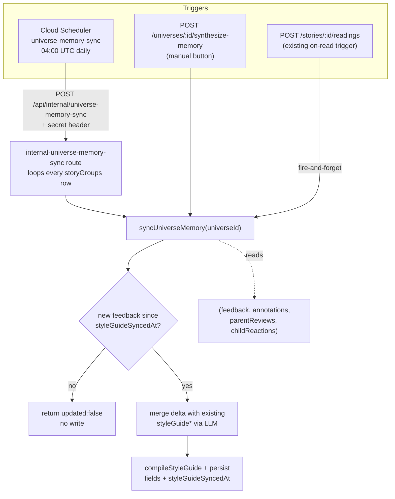

# Architecture: Universe memory nightly sync

## What changes structurally

`packages/core/src/pipeline/synthesize-universe-memory.ts` stops being a stateless "compute a fresh snapshot, let the caller persist however it likes" function and becomes the **single accumulating write path** for `storyGroups.styleGuide*`. It now:

1. Reads the universe's current `styleGuideSyncedAt` cursor (new column).
2. Pulls the bounded window of stories (last 50 ready/read, unchanged from today) plus, for those stories, everything from `feedback`, `annotations`, `parentReviews`, and `childReactions` created after the cursor (or everything in the window if the cursor is null — first sync).
3. If that delta is empty and the cursor is already set, returns `{ updated: false }` without calling the LLM or writing anything — this is what makes a repeat run with nothing new a true no-op.
4. Otherwise, asks the LLM to **merge** the delta into the universe's existing `works` / `doesntWork` / `techniques` / `minimize` sections (same merge-not-replace approach `updateStyleGuide` already uses for its own trigger), compiles the merged sections with the existing `compileStyleGuide` deriver, and persists the four section fields + the compiled `styleGuide` field + a refreshed `styleGuideSyncedAt` in one update.

All three call sites — the existing on-read trigger (`stories.ts`), the existing manual regenerate endpoint (`universes.ts`), and the new nightly batch endpoint — call this one function instead of each doing its own read-then-overwrite. This removes the overwrite behavior everywhere at once rather than only in the new nightly path.

`updateStyleGuide` / `style-guide-updater.ts` (the synchronous merge that runs on text approval, driven by the structured story-analyzer output) is **not** touched or unified with this. It answers a different question (what did *this one* analyzed story teach us) on a different trigger (approval) with different input shape (structured analysis, not raw feedback rows). Both already merge rather than overwrite once this change lands, so the pre-existing "two writers touch the same columns" situation stops being an overwrite race and becomes two independent accumulators occasionally interleaving on the same row — see Failure modes.

## New infrastructure

- **Cloud Scheduler job** `universe-memory-sync`, modeled directly on the existing `catalog-sync` job in `infra/index.ts`: cron `0 4 * * *` UTC (one hour after `catalog-sync`, avoiding overlap on the same Cloud Run instance), `httpTarget` POSTs to `https://bedtime-agent.ilya.online/api/internal/universe-memory-sync` with header `X-Universe-Memory-Sync-Secret` sourced from a new Pulumi secret config `universeMemorySyncSecret`.
- **New internal route** `packages/api/src/routes/internal-universe-memory-sync.ts`, mounted at `/api/internal/universe-memory-sync`, gated by `process.env.UNIVERSE_MEMORY_SYNC_SECRET` compared against the same header — same shape as `internal-catalog-sync.ts`. Runs the loop over universes synchronously within the scheduled request (no Cloud Tasks fan-out — universe count is small for a single-family app, and `catalog-sync` already establishes that scheduled jobs in this app run in-process).
- **New secret**: GitHub secret `PROD_UNIVERSE_MEMORY_SYNC_SECRET`, wired the same two ways `PROD_CATALOG_SYNC_SECRET` is — as a Pulumi config secret (for the Scheduler header) and directly as a Cloud Run `--set-env-vars` (for the route's own comparison) in `.github/workflows/deploy.yml`.

No new queue, no new service, no new database. This is an additive scheduled job following an already-established pattern, not a new architectural primitive.

## Data model evolution

`storyGroups` gains one column: `styleGuideSyncedAt: timestamp` (nullable, no default). `null` means "never synced by this mechanism" — the sync function treats that as "everything in the bounded story window counts as new" for the first run. No other schema changes; the four feedback-source tables (`feedback`, `annotations`, `parentReviews`, `childReactions`) are read-only from this feature's perspective — it never writes to them.

## Failure modes

- **LLM call fails or returns unparseable output for one universe** during the nightly batch: caught per-universe, logged with the universe id, loop continues to the next universe. That universe's `styleGuideSyncedAt` is left unchanged so the same delta is retried on the next run (or the next manual trigger) rather than being silently dropped.
- **Two writers race on the same universe** (e.g. nightly job and a manual click close together, or an on-read trigger firing while the nightly batch is mid-run): each call is an independent read-merge-write; whichever commits last wins. Because every writer now goes through the same `syncUniverseMemory` function, the four section fields, the compiled `styleGuide`, and `styleGuideSyncedAt` are always written together as one consistent set — the failure mode is "one accumulation lost interleaving with another," not "corrupted/partial row." Accepted as-is; not solved with a lock, given this app's single-family, low-concurrency usage (see scenarios.md SCENARIO 9).
- **`updateStyleGuide` (approval-time) and `syncUniverseMemory` (this feature) write the same row from different triggers**: both merge rather than overwrite now, so the outcome is "last commit's merge wins," same class of race as above, not a data-loss regression versus today. Not unified in this change — different trigger, different input shape, unifying them is a larger refactor not required by the done-when criteria.
- **Scheduler fires but Cloud Run is cold/slow and the request exceeds `attemptDeadline`**: matches `catalog-sync`'s existing `attemptDeadline: '300s'` + `retryConfig` handling; reused as-is.
- **Secret missing/misconfigured in a fresh environment**: route returns 401, same as `catalog-sync` and the worker routes today — fails closed, not open.
- **Feedback left on a story outside the 50-most-recent-stories window**: invisible to synthesis. Pre-existing limitation of `synthesizeUniverseMemory`, carried forward unchanged (see spec.md Scope boundary) — not introduced by this change.
- **Unbounded growth of the style guide text across months of nightly merges**: prevented by carrying forward the same per-section length caps `style-guide-updater.ts` already enforces in its merge prompt (works <=10 lines, doesntWork <=6, minimize <=5) — the merge prompt asks the LLM to distill, not append.

## Rollout

Additive and backward compatible:
1. Migration adds the nullable column — no backfill needed (`null` is a valid, meaningful "never synced" state).
2. Deploy carries the new route, the refactored `synthesize-universe-memory.ts`, and the updated callers together (they must land in the same deploy — a stale caller expecting the old return shape would break the fire-and-forget call).
3. Infra (`pulumi up`) adds the Scheduler job and secret; can be applied before or after the code deploy since the job only starts firing once the Scheduler resource exists, and the route simply won't be hit until then.
4. No feature flag needed — this is a background job with no user-facing surface change beyond "the memory panel now reflects more feedback sources and doesn't reset on every trigger," which is strictly an improvement over today's overwrite behavior.
