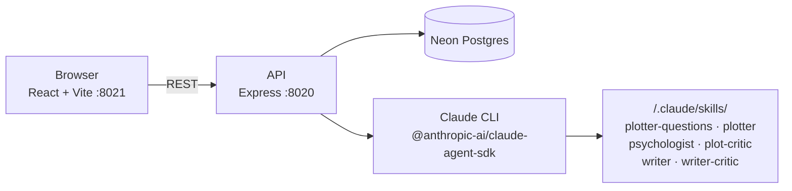
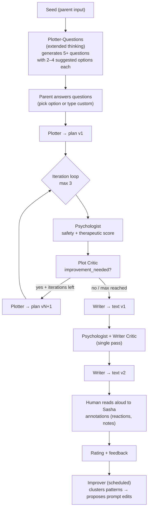

# Architecture: "Книга Гоши"

## System

## Story Pipeline

## Agent Involvement by Scenario

```mermaid
flowchart TD
    subgraph S1["Scenario 1 — Initial planning"]
        PQ["PlotterQuestions\ngenerates clarifying questions"]
        PQ --> P1["Plotter\nwrites planV1"]
        P1 --> L1{"Loop ≤ 3×"}
        L1 --> Ps1["Psychologist\niteration 1 and last only"]
        Ps1 --> PC1["PlotCritic\nimprovement_needed?"]
        PC1 -- yes --> P1b["Plotter\nrewrites plan"]
        P1b --> L1
        PC1 -- no --> READY1["plan_ready"]
    end

    subgraph S2["Scenario 2 — Redo with parent annotations"]
        ANN["Parent highlights text\nand writes comments"]
        ANN --> P2["Plotter\nsame seed + PARENT FEEDBACK block"]
        P2 --> L2{"Loop ≤ 3×"}
        L2 --> Ps2["Psychologist"]
        Ps2 --> PC2["PlotCritic"]
        PC2 -- yes --> P2b["Plotter\nrewrites"]
        P2b --> L2
        PC2 -- no --> READY2["plan_ready"]
    end

    subgraph S3["Scenario 3 — Approve plan → text phase"]
        W1["Writer\nwrites textV1 from planFinal"]
        W1 --> Ps3["Psychologist\nscores text"]
        Ps3 --> WC["WriterCritic\nflags issues"]
        WC --> W2["Writer\nrewrites → textV2"]
        W2 --> READY3["text_ready"]
    end

    subgraph S4["Scenario 4 — Improver (out-of-band, scheduled)"]
        FBs["All agent_run feedbacks\n+ structured ratings"]
        FBs --> I1["Improver pass 1\nclusters historical patterns"]
        I1 --> I2["Improver pass 2\nproposes prompt edits per agent"]
        I2 --> HUMAN["Human reviews\napplies or rejects changes"]
        HUMAN --> Prompts["New prompt version\nstored in DB\nused on next run"]
    end
```

### Notes
- **Psychologist** runs in two different contexts: evaluating a *plan* (iteration 1 + last) and evaluating *text* (single pass). Same agent, different prompt.
- **Improver** is out-of-band — it never runs during story generation. It reads historical feedback and proposes prompt edits for a human to review.
- **PlotterQuestions** only runs on the very first pipeline trigger, never on redo or text phase.
- **Parent annotations** (Scenario 2) only affect Plotter's initial prompt. The critic loop still runs normally after that.
