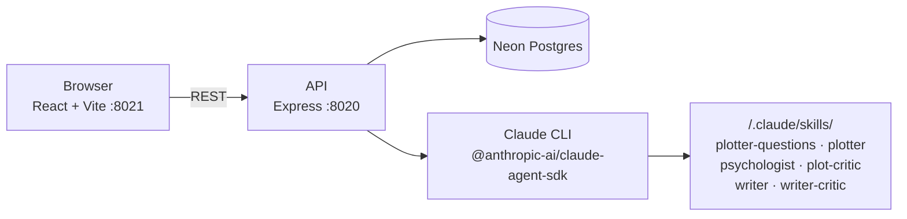
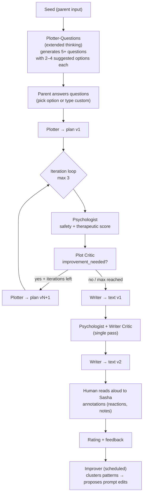

# Architecture: "Книга Гоши"

## System

```mermaid
flowchart LR
    Browser["Browser\nReact + Vite :8021"] -->|REST| API["API\nExpress :8020"]
    API --> DB[("Neon Postgres")]
    API --> Runner["Claude CLI\n@anthropic-ai/claude-agent-sdk"]
    Runner --> Skills["/.claude/skills/\nplotter-questions · plotter\npsychologist · plot-critic\nwriter · writer-critic"]
```

## Story Pipeline

```mermaid
flowchart TD
    Seed["Seed (parent input)"] --> Q["Plotter-Questions\n(extended thinking)\ngenerates 5+ questions\nwith 2–4 suggested options each"]
    Q --> Answers["Parent answers questions\n(pick option or type custom)"]
    Answers --> Plan["Plotter → plan v1"]

    Plan --> Loop{"Iteration loop\nmax 3"}
    Loop --> Psych["Psychologist\nsafety + therapeutic score"]
    Psych --> Critic["Plot Critic\nimprovement_needed?"]
    Critic -- "yes + iterations left" --> Plan2["Plotter → plan vN+1"]
    Plan2 --> Loop
    Critic -- "no / max reached" --> Writer["Writer → text v1"]

    Writer --> TextPass["Psychologist + Writer Critic\n(single pass)"]
    TextPass --> Writer2["Writer → text v2"]
    Writer2 --> Reader["Human reads aloud to Sasha\nannotations (reactions, notes)"]
    Reader --> FB["Rating + feedback"]
    FB --> Improver["Improver (scheduled)\nclusters patterns → proposes prompt edits"]
```
