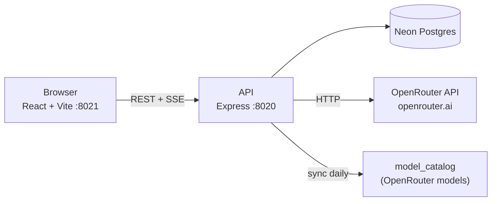
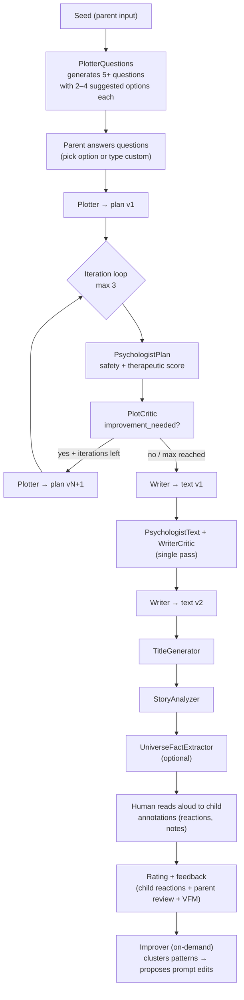

# Architecture: "Книга Гоши"

## System



## Story Pipeline



## Pipeline Stages

14 named stages, each with configurable primary + fallback model:

| Stage | JSON Schema | Min Output Tokens | Purpose |
|-------|-------------|-------------------|---------|
| `plotter` | no | 2000 | Generate story plan |
| `plotCritic` | yes | 1000 | Critique plan quality |
| `writer` | no | 4000 | Write story text |
| `writerCritic` | yes | 1000 | Critique text quality |
| `psychologistPlan` | yes | 1000 | Safety review of plan |
| `psychologistText` | yes | 1000 | Safety review of text |
| `plotterQuestions` | yes | 1000 | Generate clarifying questions |
| `improver` | no | 2000 | Improve prose quality |
| `titleGenerator` | no | 200 | Generate story title |
| `storyAnalyzer` | yes | 1000 | Analyze completed story |
| `universeFactExtractor` | yes | 500 | Extract universe/character facts |
| `feedbackSynthesizer` | no | 1000 | Synthesize historical feedback |
| `styleGuideUpdater` | no | 1000 | Update universe style guide |
| `universeContextUpdater` | no | 1000 | Update universe context |

## Model Selection

Models are resolved per stage at pipeline runtime in this priority order:

1. Per-story override (`stories.agentOverrides`)
2. Per-universe override (`storyGroups.agentOverrides`)
3. Hardcoded default (Claude Sonnet 4 primary, Claude 3.5 Haiku fallback)

`recommendModelForStage()` in `openrouter/recommend-model.ts` queries the `model_catalog` table to find the cheapest capable model for a stage's requirements (JSON schema support + minimum output tokens), ranked: permanently-free → temporarily-free → cheapest paid.

## OpenRouter Integration

```
packages/core/src/openrouter/
  openrouter.client.ts          HTTP client (listModels, chatStream, chatNonStream)
  openrouter.runner.ts          AiRunner implementation (runText / runStructured)
  openrouter-catalog-fetcher.ts Fetches + parses full model list from OpenRouter API
  derive-catalog-sync-diff.ts   Computes upsert / soft-delete / undelete diff
  sync-catalog.ts               Daily catalog sync scheduler (fires on boot, then every 24h)
  recommend-model.ts            Picks cheapest capable model per stage
  derive-structured-request-payload.ts  Builds request with optional response_format
  json-extract.ts               Parses + validates JSON from model responses
```

The daily sync fetches all ~350+ OpenRouter models and stores them in `model_catalog` with full metadata: pricing, context length, max output tokens, JSON schema support, free tier status, expiration date, modality.

## Data Model (key tables)

| Table | Purpose |
|-------|---------|
| `stories` | Story lifecycle: seed → plan → text → read |
| `story_groups` | Universe / character context + style guide |
| `universe_characters` | Characters within a universe |
| `universe_suggestions` | AI-proposed universe facts pending approval |
| `model_catalog` | OpenRouter model metadata (synced daily) |
| `model_calls` | Per-call log: tokens, cost (USD micros), latency, success |
| `model_swap_events` | User-initiated model swaps with reason tracking |
| `value_for_money_feedback` | 1–5 VFM rating + note per story |
| `run_snapshots` | Snapshot of all stage models + outputs for each pipeline run |
| `plan_questions` | Interactive plotter questions + parent answers |
| `annotations` | Parent/child reactions highlighted on story text |
| `child_reactions` | Post-reading structured feedback from the child |
| `parent_reviews` | Post-reading structured review from the parent |
| `story_readings` | Timestamps of each read session |
| `feedback` | Legacy free-form feedback |
| `prompts` | Versioned prompt history per agent |

## API Routes

### Stories
- `POST /api/stories` — create + trigger pipeline
- `GET /api/stories` — list with filters (status, groupId, sort)
- `GET /api/stories/:id` — story detail
- `PATCH /api/stories/:id` — update fields
- `POST /api/stories/:id/trigger-pipeline` — re-run pipeline
- `POST /api/stories/:id/swap-model` — swap model for a stage + optional re-run
- `POST /api/stories/:id/value-for-money` — log VFM feedback

### Models
- `GET /api/models` — list non-deleted models from catalog

### Admin analytics
- `GET /api/admin/spend-over-time` — monthly spend aggregated by model
- `GET /api/admin/model-leaderboard` — joy-per-dollar, swap rate, plan iterations, tokens-per-char
- `GET /api/admin/awaiting-feedback` — stories ready/read but missing VFM feedback
- `GET /api/admin/stories-table` — full stories table with cost + quality metrics

## Agent Involvement by Scenario

```mermaid
flowchart TD
    subgraph S1["Scenario 1 — Initial planning"]
        PQ["PlotterQuestions\ngenerates clarifying questions"]
        PQ --> P1["Plotter\nwrites planV1"]
        P1 --> L1{"Loop ≤ 3×"}
        L1 --> Ps1["PsychologistPlan\niteration 1 and last only"]
        Ps1 --> PC1["PlotCritic\nimprovement_needed?"]
        PC1 -- yes --> P1b["Plotter\nrewrites plan"]
        P1b --> L1
        PC1 -- no --> READY1["plan_ready"]
    end

    subgraph S2["Scenario 2 — Redo with parent annotations"]
        ANN["Parent highlights text\nand writes comments"]
        ANN --> P2["Plotter\nsame seed + PARENT FEEDBACK block"]
        P2 --> L2{"Loop ≤ 3×"}
        L2 --> Ps2["PsychologistPlan"]
        Ps2 --> PC2["PlotCritic"]
        PC2 -- yes --> P2b["Plotter\nrewrites"]
        P2b --> L2
        PC2 -- no --> READY2["plan_ready"]
    end

    subgraph S3["Scenario 3 — Approve plan → text phase"]
        W1["Writer\nwrites textV1 from planFinal"]
        W1 --> Ps3["PsychologistText\nscores text"]
        Ps3 --> WC["WriterCritic\nflags issues"]
        WC --> W2["Writer\nrewrites → textV2"]
        W2 --> TG["TitleGenerator"]
        TG --> SA["StoryAnalyzer"]
        SA --> READY3["text_ready"]
    end

    subgraph S4["Scenario 4 — Improver (on-demand)"]
        FBs["All agent_run feedbacks\n+ structured ratings"]
        FBs --> I1["Improver\nclusters historical patterns + proposes prompt edits"]
        I1 --> HUMAN["Human reviews\napplies or rejects changes"]
        HUMAN --> Prompts["New prompt version\nstored in DB\nused on next run"]
    end
```



### Notes
- **PsychologistPlan / PsychologistText** are the same agent with different prompts, run in different pipeline phases.
- **Improver** is on-demand — it never runs automatically during story generation. It reads historical feedback and proposes prompt edits for a human to review.
- **PlotterQuestions** only runs on the very first pipeline trigger, not on redo or text phase.
- **Parent annotations** (Scenario 2) only affect Plotter's initial prompt; the critic loop runs normally after.
- **Model swaps** (Scenario 5, not diagrammed) — parent can swap the model for `plotter` or `writer` stages mid-story if the output is unsatisfying, triggering a re-run of that stage.
