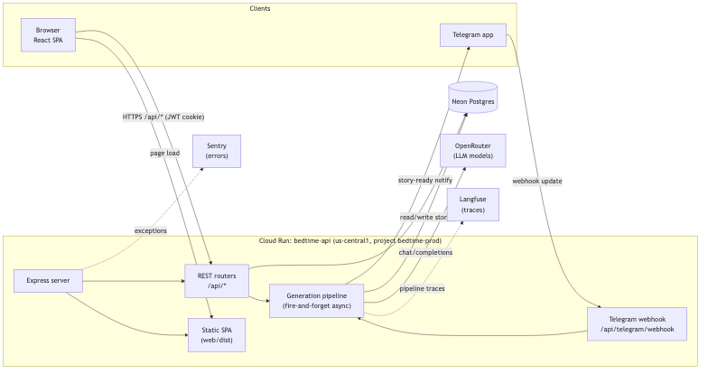
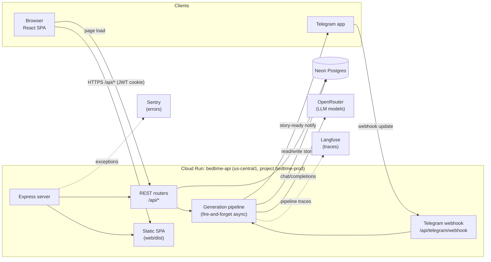

# System overview

The whole product runs as a **single Cloud Run service** (`bedtime-api`, region `us-central1`, project `bedtime-prod`). One Express server both exposes the JSON API under `/api/*` and serves the built React single-page app for every other path, so the browser and the API share one origin and one HTTPS certificate. Two kinds of clients reach it: the React SPA (authenticated with an HTTP-only JWT cookie) and the Telegram bot (updates arrive on a webhook in production, or via local polling in dev).

Story generation never happens inline in a request. The API kicks off the pipeline **fire-and-forget** and returns immediately; the pipeline then talks to OpenRouter for the language-model calls and reads/writes the Neon Postgres database. Every pipeline run is wrapped in a Langfuse trace, and uncaught server errors go to Sentry. When a story is finished the pipeline calls back into the Telegram bot to notify the parent.

