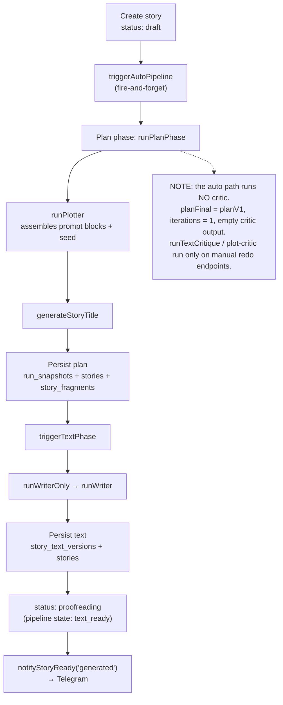
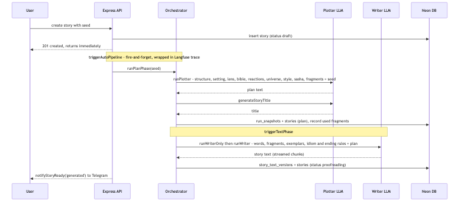
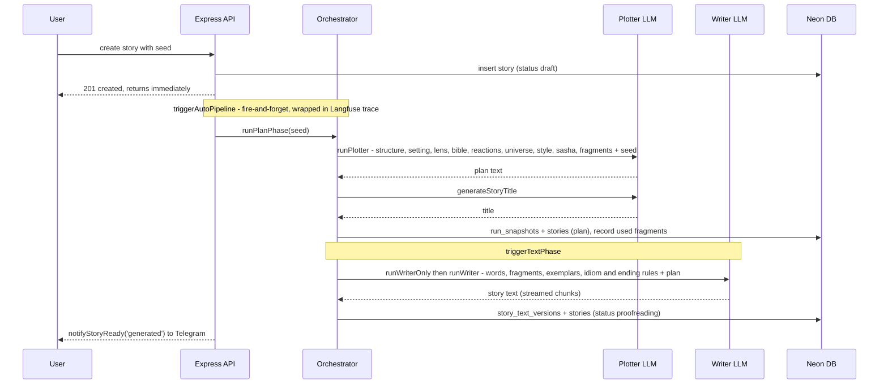
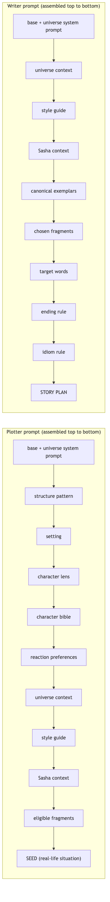
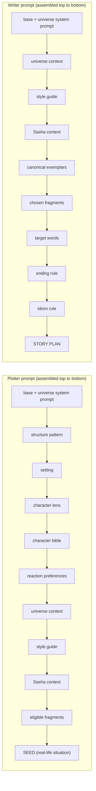

# Story generation pipeline

An automatic generation is two phases chained together. Creating a story writes a `draft` row and calls `triggerAutoPipeline`, which runs asynchronously (the HTTP caller has already got its response). The **plan phase** (`runPlanPhase` → `runPlotter`) produces a short editorial outline and a title, which are persisted; it then chains straight into the **text phase** (`triggerTextPhase` → `runWriterOnly` → `runWriter`) which writes the full story text. When the text is saved the story moves to `proofreading` and the parent is notified.

> **Important — the auto path runs no critic.** `runPlanPhase` short-circuits: it sets `planFinal = planV1`, `iterations = 1`, and returns an empty critic result. The text phase likewise never calls `runTextCritique`. The plot-critic and writer-critic models and their DB columns exist, but they are only exercised by the **manual** redo/critique endpoints (see doc 4). So the sequence below should not be read as "the critic ran and approved" — no critic ran at all.

## Phases (flowchart)

## One auto generation (sequence)

The API returns `201` the moment the draft is inserted; everything after the fire-and-forget note happens in the background inside a Langfuse trace.

## Prompt blocks

Both stages build one big prompt by concatenating optional blocks in a fixed order, then appending the payload (the seed for the plotter, the finished plan for the writer). A block is only included when its data exists — e.g. reaction preferences appear only once enough child reactions have accumulated, exemplars only when the universe has canonical stories. The structure / setting / character-lens blocks are rotated per story to fight cookie-cutter sameness.

