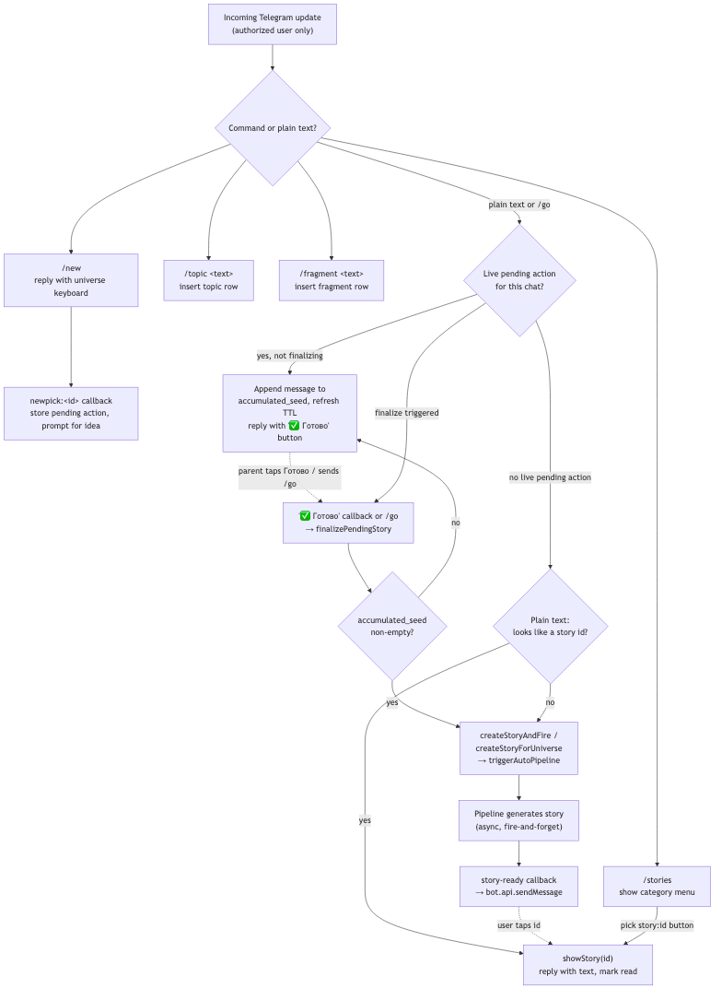
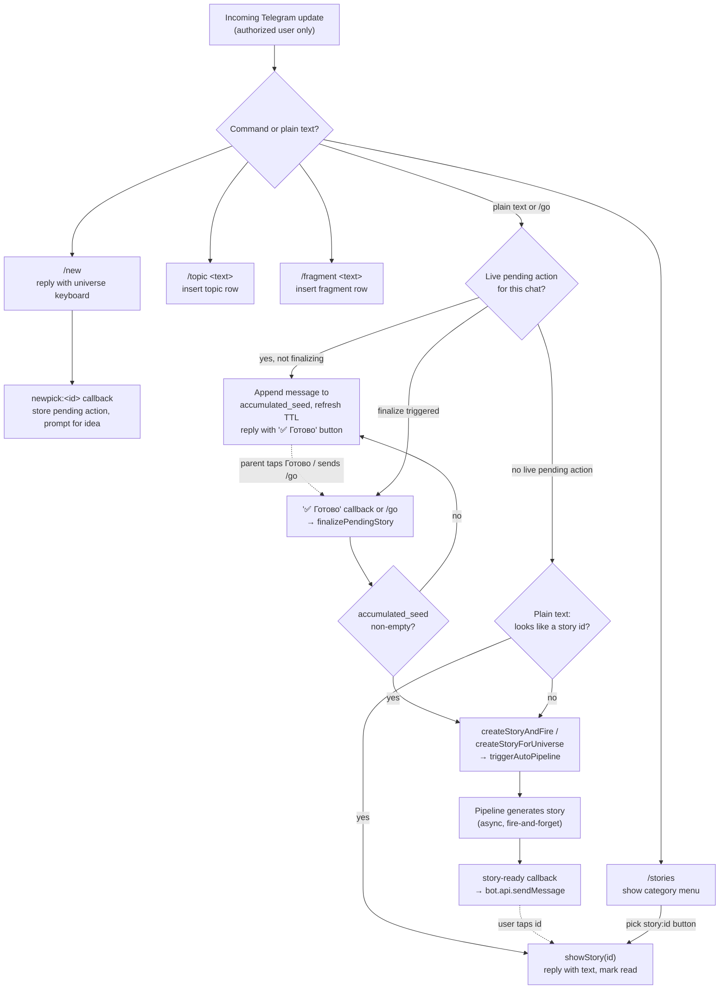

# Telegram flow

The bot only responds to one authorized user id; every command and callback checks this first. It
offers `/new` (starts the interactive story-creation flow below), `/go` (finalizes it), `/stories`
(opens an inline menu of unread/read stories), `/topic <text>` (saves a teaching theme into the
default universe's `topics`), and `/fragment <text>` (saves a delight into `fragments`). There is
also `/start`, which just lists what the bot can do.

**Outside that flow, the core interaction is plain text.** Any message that isn't a command, and
isn't sent while a story is being composed (see below), is inspected: if it parses as a bare story
id, the bot shows that story (and marks it read); otherwise the text is treated as a new story idea
— `createStoryAndFire` inserts a `draft` and calls `triggerAutoPipeline` against the most-recently-used
universe. Generation runs in the background; when it finishes, the pipeline's story-ready callback
pushes a Telegram message telling the parent the story is ready to read.

**`/new` starts an interactive, accumulate-then-generate flow instead of firing on the very next
message.** `/new` replies with an inline keyboard of every universe (`story_groups`); tapping one
stores the choice in `telegram_pending_actions` (one row per chat, keyed by `chat_id`, 30-minute
TTL) and prompts for the idea. From there, every plain-text message the parent sends is *appended*
to that row's `accumulated_seed` column instead of immediately creating a story — each message gets
an acknowledgement reply with a "✅ Готово" button, and the TTL refreshes on every append so an
actively-used session doesn't expire mid-conversation. The parent can send as many messages as they
want before finalizing. Finalizing — tapping "✅ Готово" or sending `/go` — reads the accumulated
seed, creates the story with it, and dispatches the pipeline exactly like the old one-shot flow did;
finalizing with nothing accumulated yet is a no-op that keeps the pending row alive rather than an
error. An expired or absent pending action falls through to the normal id-lookup/default-universe
path unchanged.

Both `/topic` and `/fragment` exist in `telegram.ts` today, matching the anchor's guess.

