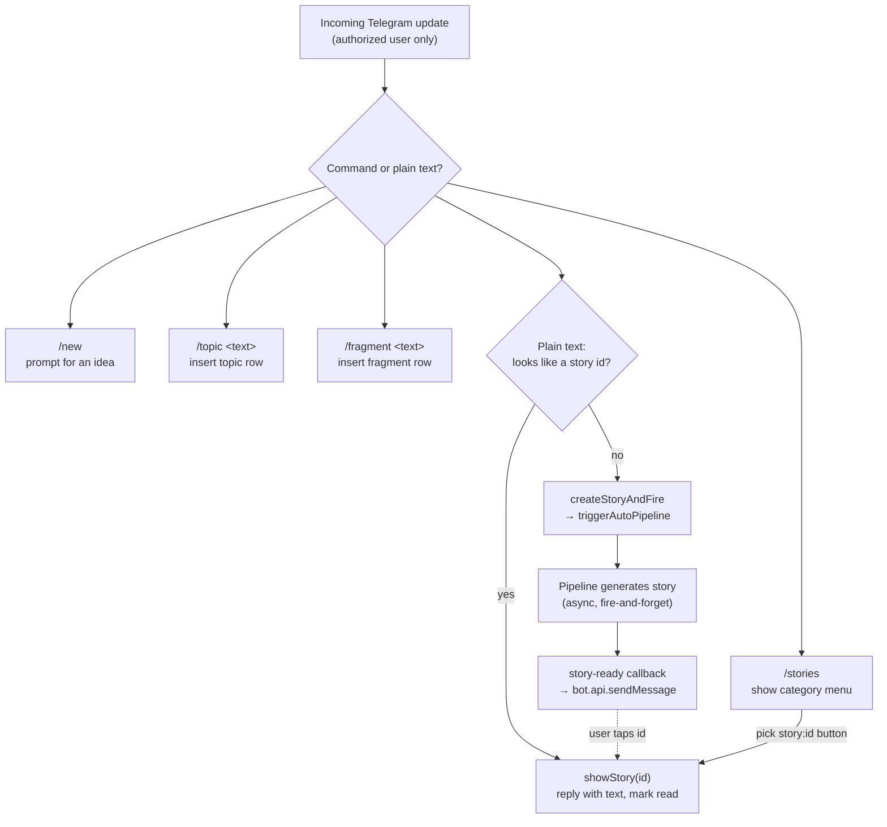

# Telegram flow

The bot only responds to one authorized user id; every command and callback checks this first. It offers four commands — `/new` (prompts for an idea), `/stories` (opens an inline menu of unread/read stories), `/topic <text>` (saves a teaching theme into the default universe's `topics`), and `/fragment <text>` (saves a delight into `fragments`). There is also `/start`, which just lists what the bot can do.

The core interaction is plain text. Any message that isn't a command is inspected: if it parses as a bare story id, the bot shows that story (and marks it read); otherwise the text is treated as a new story idea — `createStoryAndFire` inserts a `draft` and calls `triggerAutoPipeline` against the most-recent universe. Generation runs in the background; when it finishes, the pipeline's story-ready callback pushes a Telegram message telling the parent the story is ready to read.

Both `/topic` and `/fragment` exist in `telegram.ts` today, matching the anchor's guess.

