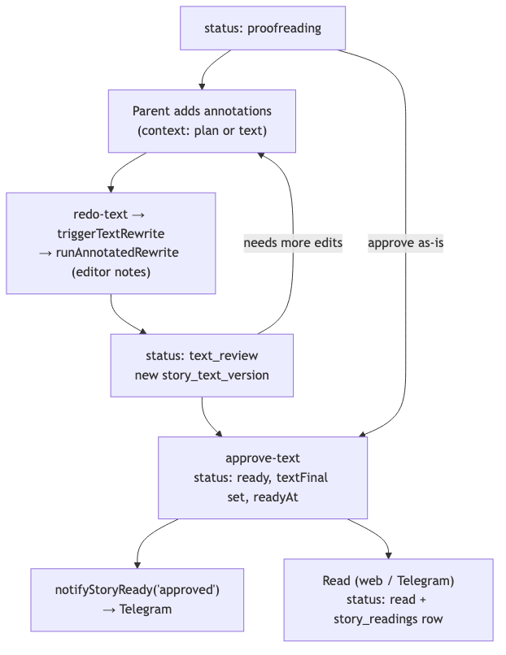
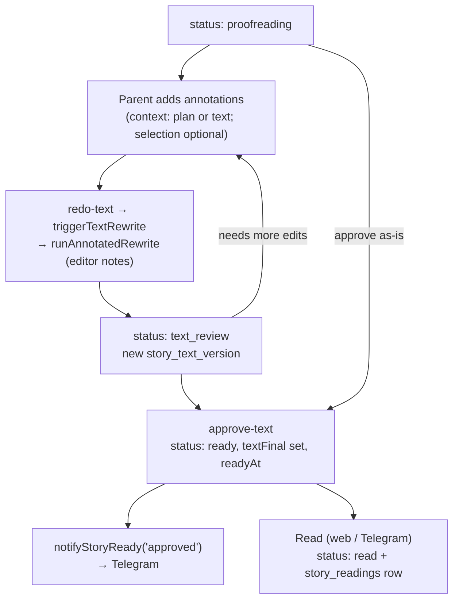
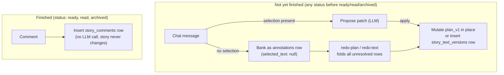
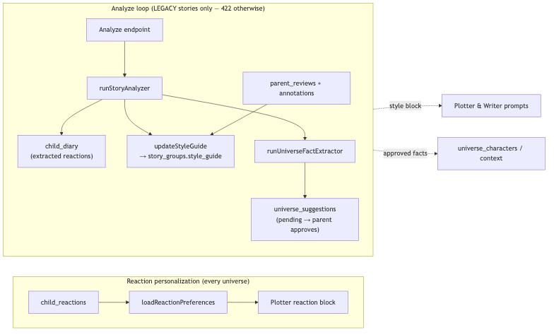
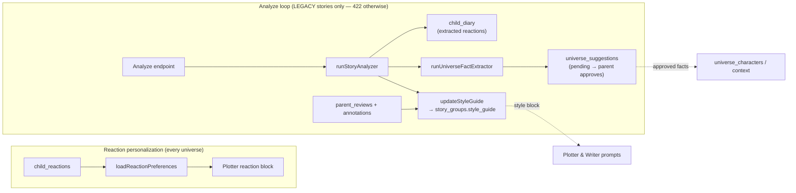

# Feedback and review

## Review loop

Once a generated story reaches `proofreading`, the parent can mark up passages with **annotations** (each tied to either the plan or the text; `selected_text` is nullable — a whole-story comment with no highlighted span is also a valid annotation). Asking for a rewrite (`redo-text` → `triggerTextRewrite` → `runAnnotatedRewrite`) feeds those annotations to the writer as explicit editor notes and produces a new `story_text_version`, leaving the story in `text_review`. This can repeat as many times as needed. When the parent is satisfied, `approve-text` promotes the story to `ready` (copying the chosen version into `text_final`) and notifies Telegram. Reading it — in the web app or the bot — flips it to `read` and logs a `story_readings` row.

## Chat-based feedback

A single chat surface (`StoryChatPanel`, backed by `POST /api/pipeline/conversations/:storyId`) is reachable from the plan-review, text-review, and story-reader pages. It takes a `context` (`'plan'` or `'text'`) that decides which source it reads and, when a patch is applied, which mechanism mutates it:

- **A message with a selected passage** proposes a concrete replacement (LLM call, patch + one-line summary). The proposal renders as a word-level diff against the original selection (`PatchDiffView`, `packages/web/src/components/patch-diff-view.tsx`) rather than raw replacement text — this is presentation only, the parsing (`parsePatchBlock`) and apply mechanism below are unchanged. Applying it is context-specific: a **plan** patch mutates `stories.plan_v1` in place (matching the pre-existing plan-chat behavior — plans have no version history). A **text** patch inserts a new `story_text_versions` row (`stage: 'chat_patch'`) and repoints `active_text_version_id`, preserving the existing text version-history invariant.
- **A message with no selection** is banked as an `annotations` row (`selected_text: null`, no LLM call) instead of a one-off freeform reply. It is folded into the next `redo-plan`/`redo-text` batch alongside highlight-based annotations, exactly like today's highlight+note flow.
- **Once a story reaches `ready`, `read`, or `archived`**, the chat/patch/bank path is rejected (409, `resolveChatGate`) — the story's plan and text can no longer change. The rejection names the replacement: `POST /api/stories/:id/comments` (`story_comments` table). This is a plain record-and-list endpoint with no LLM call — a durable, timestamped, universe-attributable comment that a later universe-memory pass can read, but which never feeds back into this story's own regeneration.

## Learning loops

Two independent learning loops feed back into future stories, and they use **different signals** — the anchor map lumped them together, but in the code they are separate:

1. **Reaction personalization (runs for any universe).** The child's structured `child_reactions` are summarized by `loadReactionPreferences` and injected as the plotter's reaction block, so what landed well nudges future plots. These reactions do **not** feed the style guide.

2. **The analyze loop (legacy stories only).** The analyze endpoint refuses non-legacy stories (returns 422 unless `source === 'legacy'`). For a legacy story it runs `runStoryAnalyzer`, writes extracted child reactions into `child_diary`, updates the cumulative **style guide** on `story_groups` (fed by the analysis plus parent reviews and annotations), and runs `runUniverseFactExtractor` to propose new `universe_suggestions` (pending until the parent approves). The style guide then flows into both the plotter and writer prompts; approved suggestions become universe characters/context.

