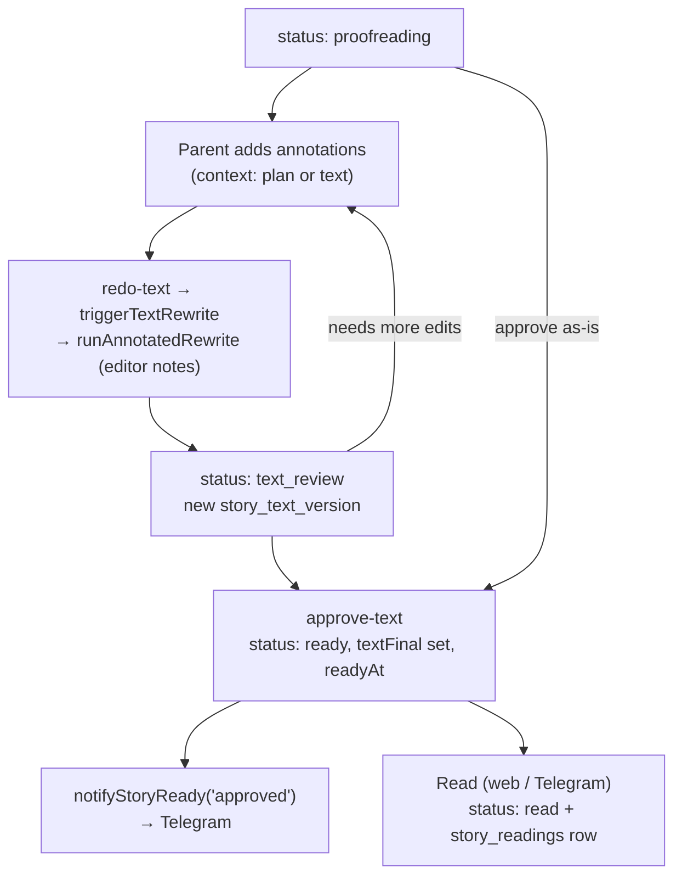
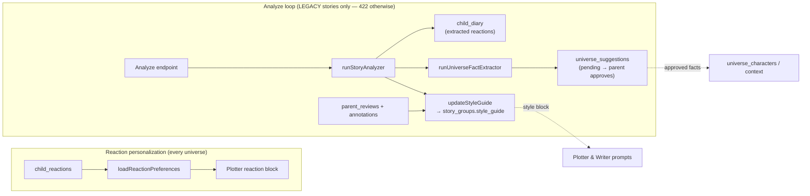

# Feedback and review

## Review loop

Once a generated story reaches `proofreading`, the parent can mark up passages with **annotations** (each tied to either the plan or the text). Asking for a rewrite (`redo-text` → `triggerTextRewrite` → `runAnnotatedRewrite`) feeds those annotations to the writer as explicit editor notes and produces a new `story_text_version`, leaving the story in `text_review`. This can repeat as many times as needed. When the parent is satisfied, `approve-text` promotes the story to `ready` (copying the chosen version into `text_final`) and notifies Telegram. Reading it — in the web app or the bot — flips it to `read` and logs a `story_readings` row.

## Learning loops

Two independent learning loops feed back into future stories, and they use **different signals** — the anchor map lumped them together, but in the code they are separate:

1. **Reaction personalization (runs for any universe).** The child's structured `child_reactions` are summarized by `loadReactionPreferences` and injected as the plotter's reaction block, so what landed well nudges future plots. These reactions do **not** feed the style guide.

2. **The analyze loop (legacy stories only).** The analyze endpoint refuses non-legacy stories (returns 422 unless `source === 'legacy'`). For a legacy story it runs `runStoryAnalyzer`, writes extracted child reactions into `child_diary`, updates the cumulative **style guide** on `story_groups` (fed by the analysis plus parent reviews and annotations), and runs `runUniverseFactExtractor` to propose new `universe_suggestions` (pending until the parent approves). The style guide then flows into both the plotter and writer prompts; approved suggestions become universe characters/context.

