# Data model (core tables)

A **universe** is the `story_groups` table (the code and UI call it a universe; the table name is historical). Everything hangs off it: a universe owns its `stories` and its reusable ingredients — `universe_characters`, `topics`, `fragments`, `words`, plus generated `story_ideas` and pending `universe_suggestions`.

Each **story** accumulates review and learning artifacts: free-form `annotations`, at most one `parent_reviews` row and one `child_reactions` row (both unique per story), a history of `story_text_versions`, one `run_snapshots` row per pipeline run, and a `story_readings` log. Topics, fragments, and words attach to stories through the join tables `story_topics`, `story_fragments`, and `story_words` (many-to-many). Only the enumerated core tables are shown here — operational tables (model catalog, model calls, plan questions, swap events, etc.) are omitted to keep the relationships readable.

```mermaid
erDiagram
  story_groups ||--o{ stories : "owns"
  story_groups ||--o{ universe_characters : "defines"
  story_groups ||--o{ topics : "collects"
  story_groups ||--o{ fragments : "collects"
  story_groups ||--o{ words : "collects"
  story_groups ||--o{ story_ideas : "suggests"
  story_groups ||--o{ universe_suggestions : "pending facts"
  stories ||--o{ annotations : "receives"
  stories ||--o| parent_reviews : "reviewed by"
  stories ||--o| child_reactions : "reacted to by child"
  stories ||--o{ story_text_versions : "versions"
  stories ||--o{ run_snapshots : "pipeline runs"
  stories ||--o{ story_readings : "read log"
  stories ||--o{ story_fragments : ""
  fragments ||--o{ story_fragments : ""
  stories ||--o{ story_words : ""
  words ||--o{ story_words : ""
  stories ||--o{ story_topics : ""
  topics ||--o{ story_topics : ""

  story_groups {
    serial id PK
    text name "the universe"
    text system_prompt
    text style_guide
  }
  stories {
    serial id PK
    int group_id FK
    text seed
    text status "draft proofreading ready read"
    text plan_final
    text text_final
    int active_text_version_id
  }
  universe_characters {
    serial id PK
    int universe_id FK
    text name
    text traits
  }
  topics {
    serial id PK
    int universe_id FK
    text title
  }
  fragments {
    serial id PK
    int universe_id FK
    text text
  }
  words {
    serial id PK
    int universe_id FK
    text word
  }
  story_ideas {
    serial id PK
    int universe_id FK
    text seed_text
    text status "pending approved rejected"
  }
  universe_suggestions {
    serial id PK
    int universe_id FK
    text fact_text
    text status "pending approved rejected"
  }
  annotations {
    serial id PK
    int story_id FK
    text selected_text
    text note_text
    text context "plan or text"
  }
  parent_reviews {
    serial id PK
    int story_id FK "unique"
    int rating
    bool would_reuse
  }
  child_reactions {
    serial id PK
    int story_id FK "unique"
    int enjoyed
    bool was_funny
  }
  story_text_versions {
    serial id PK
    int story_id FK
    int version_number
    text stage "writer_initial writer_critic annotated_rewrite"
  }
  run_snapshots {
    serial id PK
    int story_id FK
    text plan_v1
    text text_v1
  }
  story_readings {
    serial id PK
    int story_id FK
    timestamp read_at
  }
  story_fragments {
    serial id PK
    int story_id FK
    int fragment_id FK
  }
  story_words {
    serial id PK
    int story_id FK
    int word_id FK
  }
  story_topics {
    serial id PK
    int story_id FK
    int topic_id FK
  }
```

