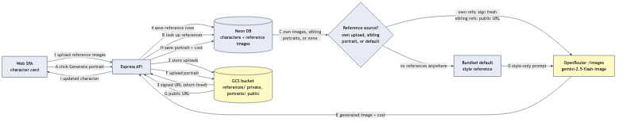

# Character reference images and portraits

Every character in a universe's character bible can carry a set of uploaded baseline reference images (photos or drawings a person supplies) and one current AI-generated portrait, with up to 3 previous portraits kept alongside it. Nothing here happens automatically — both uploading a reference and generating a portrait are explicit, manual actions taken from the character card in the universe management screen. Saving a character's bible fields (name, description, age, traits) never triggers generation and never incurs cost.

Generating a portrait always resolves exactly one reference source through a fixed, three-tier fallback, evaluated fresh on every click:

1. **Own references** — if the character has any uploaded reference images, all of them are used as identity references, and the model is asked to match the character's appearance to them.
2. **Universe sibling style** — if the character has no references of its own but another character in the same universe already has a generated portrait, up to 3 of the most recent sibling portraits are used purely as art-style references (never identity references) — the model still invents this character's own appearance from its bible fields. A character never sees its own past portraits offered back to it as a sibling.
3. **Default style** — if neither of the above exists (typically the very first character generated in a brand-new universe), the app's own bundled default-style image is used the same way: style only, appearance invented from the bible fields.

Every generation, regardless of tier, asks for one character alone in a clean portrait/headshot presentation — never a scene.

## Storage split: private references, public portraits

Uploaded reference images and generated portraits are treated differently because they carry different privacy risk — a reference image in this app could plausibly be a real photo of a real person, while a generated portrait is AI art with no such concern. This split is enforced with **two separate GCS buckets**, not a prefix inside one bucket — Google Cloud IAM rejects a Condition combined with a public (`allUsers`) grant ("Conditions are not allowed on public resources"), so a single bucket can't be made public for one prefix and private for another:

- Generated portraits live in `bedtime-prod-storage` (under a `portraits/` prefix, kept for path-shape consistency with references, though the whole bucket is public-read now). The app never signs a URL for them — a portrait's public URL is always just deterministic string formatting from its stored path.
- Uploaded references live in the separate `bedtime-prod-references` bucket (under a `references/` prefix), which carries no public grant at all. The only way to read one — for display in the UI, or for the one-time handoff to OpenRouter when a character's own references feed its own generation — is a signed, time-limited URL the API mints on demand (~1 hour for UI display, ~10 minutes for the one-time OpenRouter handoff).
- `GcsObjectStorage` picks the bucket per call by checking whether the object's stored path starts with `references/` — callers pass one path, never a bucket name.

Both kinds of row store a bucket-relative storage path, never a URL — a portrait's URL is always re-derivable from its path, and a reference's "URL" would be wrong the moment it went stale.

## Generation cost and failure handling

Portrait generation is a single OpenRouter call (`google/gemini-2.5-flash-image`, its own `/images` endpoint — a different endpoint from the text-completion calls the rest of the app uses) and is recorded through the same `model_calls` cost-tracking table every text generation already uses, via an optional `character_id` column alongside the existing optional `story_id`. Unlike text generation, there is no fallback-model retry on failure — this is a manual, cost-incurring action, so a failure surfaces to the person rather than silently trying to route around it a second time.

Before ever calling OpenRouter, the app checks that the requested model is a known row in its own model catalog. Without this check, a same-day gap between a new model appearing on OpenRouter and the nightly catalog sync picking it up would mean the call still succeeds and is still billed, but the cost row silently fails to insert (the cost recorder only logs a console error on a failed write, it never throws) — hiding real spend from the one place this app tracks it. The pre-flight check turns that into a loud, pre-spend refusal instead.

Because the OpenRouter call and the follow-up save (upload to GCS, then two database writes) are two separate steps with no shared transaction, a failure after the billed call succeeds is a materially different situation from a failure before it — the person was already charged. The app distinguishes these in the error shown, and records the cost row for the billed call regardless of what happens afterward.

## Portrait retention

A character's current portrait is the row in `character_portraits` with `is_current = true`. Generating a new portrait always: (1) inserts the new row as current first, (2) then flips every *other* row for that character still marked current to not-current in one statement, (3) then deletes the oldest previous rows beyond 3. The insert-before-flip ordering matters because this app's Postgres driver (`drizzle-orm/neon-http`) has no interactive transaction support — inserting first means a mid-sequence failure can leave more than one row briefly marked current rather than momentarily leaving none, and step (2)'s "every other row" (rather than "the one row noted before the insert") makes that state self-healing on the very next generation, plus every read of "the current portrait" resolves any such tie by picking the most recently generated one in the meantime. A dropped-off previous portrait's underlying GCS object is left in place, same as a deleted reference image — the storage bucket's own version history is the only recovery path beyond what the app actively keeps, and storage cost at this scale is negligible.

## Deletion

Deleting a character now cascades through its reference-image rows, its portrait rows (current and previous), and its cost-tracking rows before the character row itself, in application code rather than a database-level cascade — the same shape this app already uses for deleting a story's related rows. Without this, the first character anyone attaches an image to would become permanently undeletable on a foreign-key violation. Deleting a character does not clean up its underlying GCS objects, consistent with how deleting a single reference image already works.
