# Architecture: Interactive story chat

## What changes structurally

**Telegram pending-action state machine gains a third field.** `telegram_pending_actions` already
holds the "user picked a universe, waiting for the next message" state (one row per chat, 30-minute
TTL, upserted). It grows one nullable column, `accumulated_seed`, so the same row now also holds
"how much idea text has been collected so far." The row's lifecycle changes from *create → consume-on-next-message*
to *create → append zero-or-more times → consume-on-finalize*. Finalize is a new explicit trigger
(inline button `newgo` or `/go` command), not "whatever text arrives next."

**Read/write split on the pending-action module.** `consumePendingUniverseChoice` (read + delete)
is replaced by three functions with distinct responsibilities: `peekPendingAction` (read, does not
consume — needed because most messages during accumulation must NOT delete the row),
`appendPendingSeedText` (read-modify-write, extends the accumulated text and refreshes the TTL),
and `consumePendingAction` (read + delete, only called at finalize). This is a shape change to an
already-shipped module (`packages/api/src/routes/telegram-pending-action.ts`), not a new module —
callers (`telegram.ts`) are updated to match.

**Web create-story-modal gains a small accumulation layer in front of the existing seed field.**
`CreateStoryFormState.seed` (and the `validateCreateStoryForm` deriver that reads it) are untouched —
they still validate "one final seed string." What's new sits above that: a `contextMessages: string[]`
list plus a `buildAccumulatedSeed` pure function that folds the list (and any not-yet-added draft
text) into that single seed string right before validation/submit. No new API surface — `POST /api/stories`
still receives one `seed` string exactly as today.

**A new pure diff-computation module lands in the web package**, `computePatchDiff`, that word-diffs
`selectedText` against `pendingPatch.patch` (the `diff` npm package, `diffWords`). The existing
`<<<PATCH>>>`/`<<<SUMMARY>>>` parsing (`parsePatchBlock`, `packages/core`) and the apply-patch API
calls are untouched — the diff is a rendering step inserted between "patch parsed" and "patch
displayed," nothing upstream or downstream of it changes.

**First component-level test in the repo.** Every existing test in this monorepo runs pure/glue
logic under vitest's default `node` environment. Proving "the diff renders distinguishable added/
removed content" needs an actual DOM, so `packages/web` gets its first `jsdom`-backed React
Testing Library test. Scoped narrowly via `environmentMatchGlobs` in the root `vitest.config.ts` so
every other package keeps running under `node` — this is additive test infrastructure, not a
change to how any existing test runs.

```mermaid
flowchart TD
  subgraph telegram["Telegram (packages/api/src/routes/telegram.ts)"]
    pick["newpick:&lt;id&gt; callback<br/>setPendingUniverseChoice"]
    msg["plain-text message"]
    peek{"peekPendingAction(chatId)"}
    append["appendPendingSeedText<br/>+ refresh TTL"]
    finalize["newgo callback / '/go'<br/>consumePendingAction"]
    ready{"accumulatedSeed non-empty?"}
    fire["createStoryForUniverse<br/>(unchanged)"]
    normal["existing id-lookup /<br/>default-universe fallback"]

    pick --> msg
    msg --> peek
    peek -->|"live row"| append
    peek -->|"absent/expired"| normal
    append -.->|"parent taps Готово / sends /go"| finalize
    finalize --> ready
    ready -->|"yes"| fire
    ready -->|"no"| append
  end

  subgraph web["Web create-story-modal"]
    add["contextMessages[]<br/>+ draft field"]
    build["buildAccumulatedSeed<br/>(pure)"]
    validate["validateCreateStoryForm<br/>(unchanged)"]
    submit["POST /api/stories<br/>(unchanged)"]

    add --> build --> validate --> submit
  end

  subgraph diff["Web patch diff (story-chat-panel.tsx)"]
    parse["parsePatch (unchanged)"]
    compute["computePatchDiff<br/>(new, diffWords)"]
    render["PatchDiffView<br/>(new component)"]
    apply["applyPlanPatch / applyTextPatch<br/>(unchanged)"]

    parse --> compute --> render --> apply
  end
```



## New infrastructure

None (no new services, queues, or external APIs). One new npm dependency: `diff` (jsdiff), added to
`packages/web`. One new dev dependency set for the first time in this repo: `jsdom`,
`@testing-library/react`, `@testing-library/jest-dom`, added at the root (where `vitest.config.ts`
lives) and wired via `environmentMatchGlobs` so only `packages/web/**` tests run under `jsdom`.

## Data model evolution

`telegram_pending_actions` gains one nullable column:

```
accumulated_seed  text  (nullable, default NULL)
```

Additive, backward-compatible: a row written by the old code (no accumulation concept) simply has
`accumulated_seed = NULL`, which the new code already treats as "no idea text collected yet" — the
same state a freshly-picked universe is in under the new flow. No backfill needed, no existing row
becomes invalid.

## Failure modes

- **Telegram send fails after accumulation but before the DB write** — not a new risk class; the
  existing `appendPendingSeedText` write happens before the acknowledgement reply, same ordering
  discipline already established for `setPendingUniverseChoice` in the shipped two-step flow (durable
  state write does not depend on the Telegram API call succeeding).
- **Finalize fires with an empty accumulated seed** — handled explicitly as a no-op (SCENARIO A4),
  not an error path; the row survives so the parent can still complete the flow.
- **TTL race: message arrives exactly at expiry** — unchanged from the shipped behavior;
  `isPendingActionExpired` remains the single source of truth for the boundary, exercised by the
  existing pure-function tests plus a new case for TTL renewal on each append.
- **Web: parent removes every accumulated message and also clears the draft field** — submit button
  disables via the existing `validateCreateStoryForm` empty-seed check; no new failure path.

## Rollout

Single deploy, no feature flag — this is a disposable dev-branch-tested, backward-compatible change
to a single-user internal tool (the constitution's "test what earns it" plus this repo's existing
practice of shipping straight to `main` after CI). The migration is additive and safe to run ahead
of the code that uses the new column, and safe to leave in place if ever rolled back (an unused
nullable column is inert).
