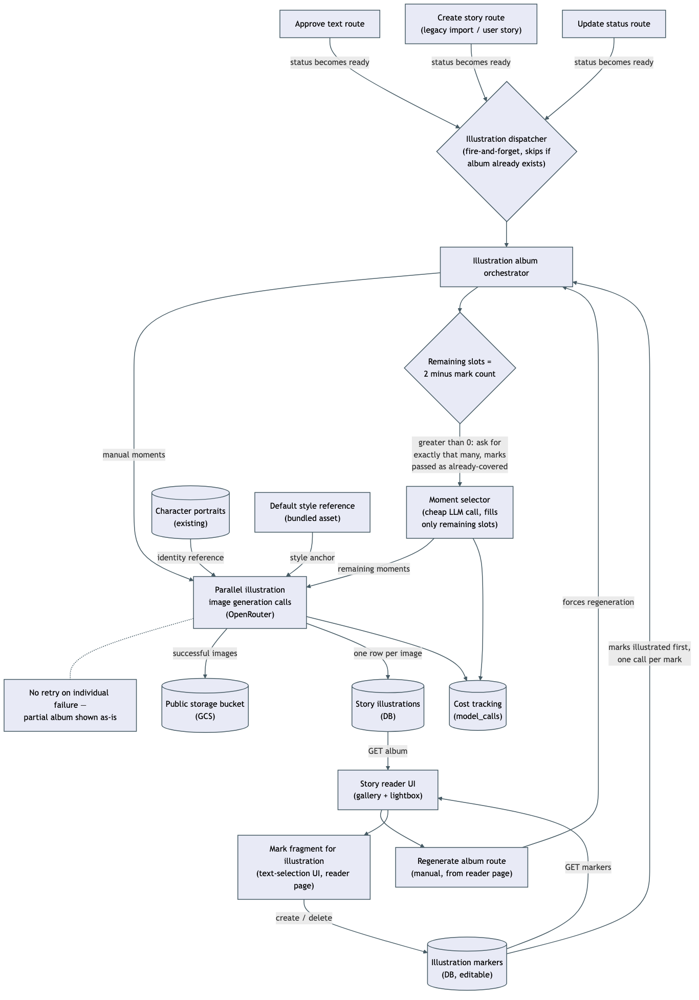

# Story illustration album

Every story that becomes ready to read automatically gets a small picture-book album — up to two illustrations, generated in the background, with no button click and no per-story confirmation. This is a real, recurring cost this app hasn't taken on before: roughly $0.08 per story by default (a cheap text call to pick two vivid moments, plus two image calls), incurred the moment a story reaches `ready` status through any of the four paths that can set it there — the normal writer-approval flow, both branches of story creation (legacy import, user-authored), and the generic status-update route.

Separately, while reading or reviewing a story's text, a person can select a passage and mark it "illustrate this" — the same kind of selection action already used on that page for reactions and notes. A marked passage is stored in its own table, never blended into the story's narrative text or into any other annotation.

## Manual marks fill their own slots, automatic fills the rest

Every marked passage always gets its own illustration — one per mark. The automatic moment-picker only fills whatever slots remain up to the target of 2, and asks for exactly that many:

- **0 marks** — the automatic picker fills both slots, unchanged from a plain automatic album.
- **1 mark** — that mark is illustrated, plus one automatically-picked moment for the remaining slot. The marks' own text is passed to the picker as "already covered" context so it doesn't duplicate the same beat.
- **2 or more marks** — only the marks are illustrated. The automatic picker is not called at all, so its (small) text-generation cost isn't spent either.

Marking is capped at 6 passages per story — generous headroom above the 1-4 a person would realistically mark by hand, while still bounding worst-case manual cost to roughly the same order of magnitude as the automatic default.

## Identity and style, reusing existing infrastructure

Both the automatic and manual paths reuse the exact same visual-identity infrastructure the character-portrait feature already built: any cast member who already has a generated portrait gets that portrait attached as an identity-only reference image (face, body, outfit — never style), capped at 3 per moment; a character with no portrait yet has their appearance invented from their bible fields, same as a fresh character portrait would be. The app's single shared default-style image is always attached last as the sole style anchor, so an illustration looks like the same picture-book universe as every character portrait — regardless of whether the moment was picked automatically or marked by hand.

The two paths identify which characters appear in a moment differently, matching how confidently each one knows the text:

- **Automatic path** — the moment-selection call itself names the characters it sees; those names are matched case-insensitively against the story's known cast, and an unmatched name is simply dropped rather than blocking the illustration.
- **Manual path** — a marked passage is scanned with a plain, deterministic, case-insensitive substring search for known cast names, with no model call involved. This is deliberate: the marked text is exactly what the person chose, and no AI re-interpretation sits between their selection and the prompt. The accepted trade-off is that a character mentioned only by pronoun ("he", "she") gets no identity reference, even with an established portrait elsewhere — a person can work around this by marking a slightly wider passage, or by using the manual regenerate action.

## Failure handling

The automatic moment-selection call and every image-generation call run independently. If moment-selection fails, any marks already collected are still illustrated — only the automatically-filled slots end up missing. If one image call fails while others succeed, the successful ones are kept and shown; nothing retries automatically. A story is always fully readable regardless of what happened to its album — illustration is a layer on top of a finished story, never a precondition for reading it. A story with no usable text yet is skipped entirely, with nothing billed.

Image-generation calls for one album run in parallel, not sequentially — same total cost either way, but a large reduction in how long the background result takes to appear. This does raise the chance any single call gets rate-limited; that's accepted, since a rate-limited call just becomes one missing picture in an otherwise-complete album, not a blocked story.

## No double-billing, no automatic refresh

The album orchestrator's own skip-if-exists check is the single source of truth for idempotency: if a story already has an album, none of the four ready-transition call sites re-runs it or bills it again. A manual "regenerate album" action on the reading page is the only way to force a fresh run — it discards the existing illustrations outright (no history retention, unlike character portraits) and picks up whatever marks currently exist, filling any remaining slots automatically. Sending a story back for rewriting and re-approving it does **not** automatically refresh a now-stale album, even if the text or marks changed in the meantime — the manual regenerate action is the intended way to bring it back in sync.

## Storage and cost tracking

Generated illustrations live in the same public GCS bucket character portraits already use, under a new `illustrations/` top-level prefix — no new bucket or IAM change was needed, since that bucket's public-read grant is bucket-wide. Every illustration call (the moment-selection text call and each image call) is recorded through the same `model_calls` cost-tracking table every other stage in this app already uses, attributed to the story via its existing nullable `story_id` column. Unlike a character portrait's cost row, an illustration's `character_id` is left null — one illustrated moment can span several characters, and that column only ever attributes a call to one thing; per-moment character traceability instead lives on the illustration's own `character_ids` column.

## Reading page

The reading page renders the current album as a row of clickable thumbnails, in the order illustrations were generated — manual moments first (in mark-creation order), then automatic moments (in the picker's own order). Clicking a thumbnail opens a large lightbox view with left/right paging across every illustration in the album. A "regenerate album" button carries the same real-cost confirmation prompt the character-portrait feature already uses before a paid, one-click action. Marking a passage is available regardless of the story's status — draft, proofreading, ready, or read — since the underlying text-selection mechanism it reuses is already active at every status on that page.

The offline, one-off bulk-import script (`notion-import.ts`) that writes `stories` rows directly to the database is deliberately **not** wired to this side effect — it can insert many `ready`-status rows in one run, and auto-triggering paid illustration generation for a large historical batch nobody asked to have illustrated would be an easy-to-miss cost surprise.
