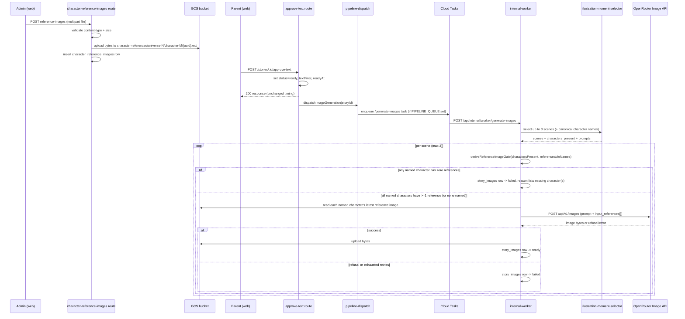

# Story illustration generation

Approving a story's text (`POST /stories/:id/approve-text` with `approved: true`) triggers a second, fully independent background job alongside the existing analysis dispatch: illustration generation. It mirrors the existing `dispatchAnalysis` shape exactly — Cloud Tasks queue when `PIPELINE_QUEUE` is configured, in-process fallback otherwise, secret-header-protected internal worker route, failures caught and logged at the call site, never propagated to the approval response.

## What happens

1. **Moment selection** — `selectIllustrationMoments` (`packages/core/src/pipeline/stages/illustration-moment-selector.ts`), a structured LLM stage running through `aiRunner.runStructured`, reads the story's final text and the universe's canonical character names, and picks up to 3 scenes (opening, climax, resolution), each with a Russian `scene_description`, the characters present (grounded to canonical names where possible), and an English `image_prompt`.
2. **Reference image gate** — before any paid API call, `deriveReferenceImageGate` checks that every character named in the scene (matched to the universe's character bible via normalized, case/whitespace-insensitive comparison — `charactersMatch`) has at least one admin-uploaded row in `character_reference_images`. A scene with any missing character never reaches OpenRouter: its `story_images` row is written straight to `status = 'failed'` with `failure_reason = 'no reference image for character: <name[, name...]>'`. A scene naming no characters (a pure establishing shot) is never gated.
3. **Prompt assembly** — `deriveIllustrationPrompt` combines each scene's `image_prompt` with the universe's `visualStyleGuide` and the visual descriptions of characters present in that scene.
4. **Image generation** — for a scene that passed the gate, `OpenRouterClient.generateImage()` calls OpenRouter's Unified Image API (`POST /api/v1/images`, model `google/gemini-2.5-flash-image`), attaching one reference image per named character (each character's most recently uploaded `character_reference_images` row, read from GCS and base64-encoded) as `input_references`.
5. **Storage** — successful bytes are uploaded to the private `bedtime-prod-storage` GCS bucket via `gcs-images.ts`; the `story_images` row is marked `ready` with its `gcs_path` and `reference_image_used = true` whenever at least one character reference was attached. The frontend never talks to GCS directly — only to authenticated proxy routes.

Character consistency is entirely admin-driven: an admin uploads canonical reference images per character (`POST /api/universes/:universeId/characters/:charId/reference-images`, multipart upload via `multer`, stored under `character-references/universe-{id}/character-{id}/{uuid}.{ext}`). Nothing is ever auto-populated — there is no universe-wide "canonical reference image" derived from a generation's own output.

## Failure handling

- **Content moderation refusal** — OpenRouter returns HTTP 400 with an error body whose message matches `no image data` (confirmed against the live API). This is classified as `moderation_refused` and never retried.
- **Transient errors** (429/5xx/network) — classified `retryable`, retried up to 3 total attempts per scene (`MAX_IMAGE_ATTEMPTS` in `image-retry-decision.ts`), then `failed` with `retries_exhausted`.
- **Any other error** (bad request, unknown model) — classified `terminal_error`, `failed` with `api_error`, not retried.
- **GCS upload failure after a successful generation** — treated as retryable up to the same attempt cap, then `failed` with `storage_error`. The `model_calls` row for the underlying image generation still records `success: true`, since money was genuinely spent on a usable image — only the `story_images` row reflects "not usable."
- One scene failing never blocks the other scenes for the same story, and illustration failures never affect story approval or reading.

## Storage layout

- **Generated story illustrations**: `story-images/{universe-N|no-universe}/story-{storyId}/scene-{sequenceIndex}.png` (`deriveImageStoragePath`). Served through `GET /api/stories/:id/images/:sequenceIndex`.
- **Admin-uploaded character reference images**: `character-references/universe-{universeId}/character-{characterId}/{uuid}.{ext}` (`deriveCharacterReferenceImagePath` — built only from IDs and a generated UUID, never from the character's name or the client-supplied filename). Served through `GET /api/universes/:universeId/characters/:charId/reference-images/:refId`.

Both prefixes live in the same private `bedtime-prod-storage` bucket and both proxy routes sit behind the app's existing cookie-session `requireAuth` middleware — the bucket itself has no public ACL, and the frontend never talks to GCS directly.

## One-time backfill

`POST /api/internal/backfill-images` (secret-protected via the existing `BACKFILL_SECRET`, same convention as `internal-backfill.ts`) finds `ready` stories with no `story_images` rows yet (`deriveBackfillCandidates`) and dispatches up to 20 per call through the same `dispatchImageGeneration` path, so the existing Cloud Tasks queue rate limits (`maxConcurrentDispatches: 3`) apply automatically. Safe to re-run — stories that already have image rows are skipped.
