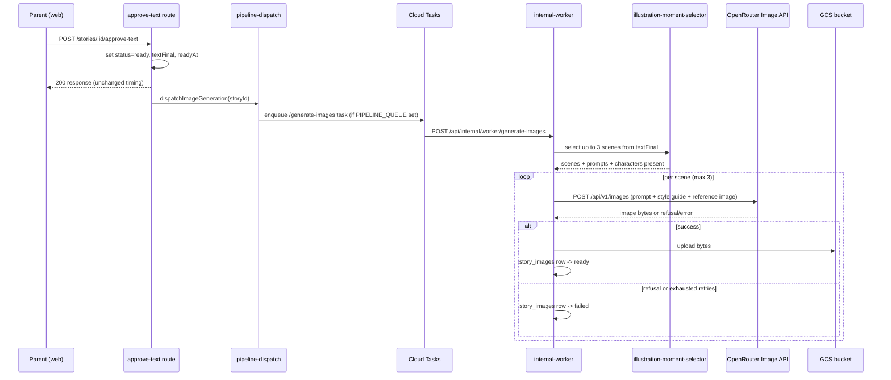

# Story illustration generation

Approving a story's text (`POST /stories/:id/approve-text` with `approved: true`) triggers a second, fully independent background job alongside the existing analysis dispatch: illustration generation. It mirrors the existing `dispatchAnalysis` shape exactly — Cloud Tasks queue when `PIPELINE_QUEUE` is configured, in-process fallback otherwise, secret-header-protected internal worker route, failures caught and logged at the call site, never propagated to the approval response.

## What happens

1. **Moment selection** — `selectIllustrationMoments` (`packages/core/src/pipeline/stages/illustration-moment-selector.ts`), a structured LLM stage running through `aiRunner.runStructured`, reads the story's final text and picks up to 3 scenes (opening, climax, resolution), each with a Russian `scene_description`, the characters present, and an English `image_prompt`.
2. **Prompt assembly** — `deriveIllustrationPrompt` combines each scene's `image_prompt` with the universe's `visualStyleGuide` and the visual descriptions of characters present in that scene.
3. **Image generation** — `OpenRouterClient.generateImage()` calls OpenRouter's Unified Image API (`POST /api/v1/images`, model `google/gemini-2.5-flash-image`), optionally passing the universe's canonical `referenceImagePath` as image-to-image input for visual consistency across stories.
4. **Storage** — successful bytes are uploaded to the private `bedtime-prod-storage` GCS bucket via `gcs-images.ts`; the `story_images` row is marked `ready` with its `gcs_path`. The frontend never talks to GCS directly — only to an authenticated proxy route.
5. **Reference image bootstrap** — if the universe had no `reference_image_path` yet, the first successful image in a run is snapshotted and saved as the canonical reference for every future generation in that universe. The universe's reference is read once at the start of a run and never re-read mid-run, so a scene that succeeds first in a bootstrap run cannot leak into the same run's later scenes.

## Failure handling

- **Content moderation refusal** — OpenRouter returns HTTP 400 with an error body whose message matches `no image data` (confirmed against the live API). This is classified as `moderation_refused` and never retried.
- **Transient errors** (429/5xx/network) — classified `retryable`, retried up to 3 total attempts per scene (`MAX_IMAGE_ATTEMPTS` in `image-retry-decision.ts`), then `failed` with `retries_exhausted`.
- **Any other error** (bad request, unknown model) — classified `terminal_error`, `failed` with `api_error`, not retried.
- **GCS upload failure after a successful generation** — treated as retryable up to the same attempt cap, then `failed` with `storage_error`. The `model_calls` row for the underlying image generation still records `success: true`, since money was genuinely spent on a usable image — only the `story_images` row reflects "not usable."
- One scene failing never blocks the other scenes for the same story, and illustration failures never affect story approval or reading.

## Storage layout

GCS object paths follow `story-images/{universe-N|no-universe}/story-{storyId}/scene-{sequenceIndex}.png` (`deriveImageStoragePath`). Images are served through `GET /api/stories/:id/images/:sequenceIndex`, which sits behind the app's existing cookie-session `requireAuth` middleware — the bucket itself has no public ACL.

## One-time backfill

`POST /api/internal/backfill-images` (secret-protected via the existing `BACKFILL_SECRET`, same convention as `internal-backfill.ts`) finds `ready` stories with no `story_images` rows yet (`deriveBackfillCandidates`) and dispatches up to 20 per call through the same `dispatchImageGeneration` path, so the existing Cloud Tasks queue rate limits (`maxConcurrentDispatches: 3`) apply automatically. Safe to re-run — stories that already have image rows are skipped.
