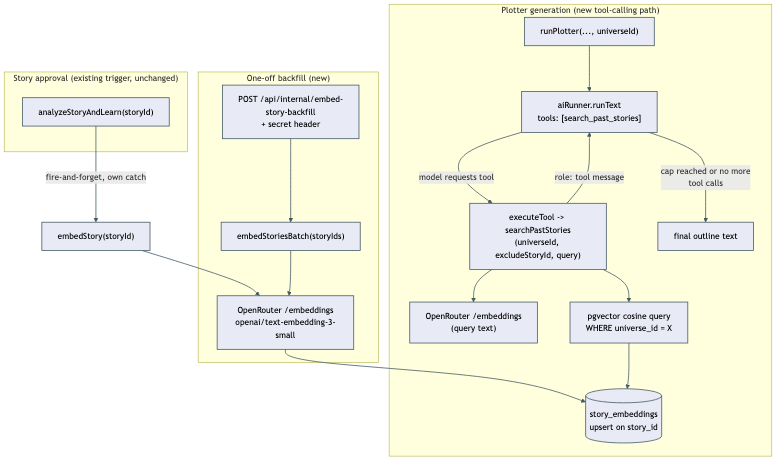
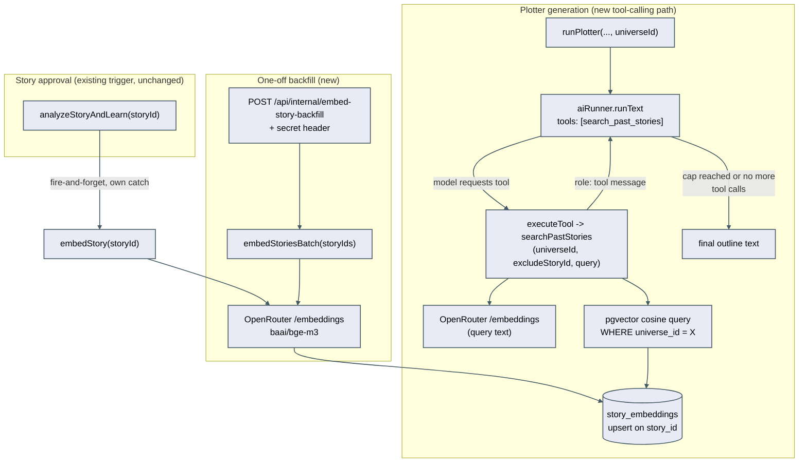

# Story retrieval (vector search + tool-calling)

Today every piece of context the plotter/writer sees is decided entirely by the orchestrator *before*
the prompt is built — `loadMemorableMoments`, the universe style guide, character bible entries, all
pre-fetched via plain SQL and concatenated into the prompt string. This feature adds a second,
model-initiated retrieval path alongside that existing pre-fetch path, without replacing it: the
plotter can call a `search_past_stories` tool, on its own initiative, to pull a relevant past story
from the same universe.

## Two new flows

**Auto-embed / backfill.** Every story's final text is turned into a vector and stored in
`story_embeddings`, one row per story, upserted on `story_id`. This happens automatically at story
approval time (`analyzeStoryAndLearn`, fire-and-forget, its own error handling) and can also be
triggered in bulk via `POST /api/internal/embed-story-backfill` (secret-gated, idempotent — a story
whose text hasn't changed since it was last embedded is skipped, not re-embedded).

**Plotter tool-calling round trip.** When the plotter has a resolved `universeId`, it is offered the
`search_past_stories` tool. If the model decides a callback would help the outline, it calls the
tool; the runner executes a pgvector cosine-similarity query scoped to that universe (excluding the
story currently being planned), and feeds the results back as a `role: 'tool'` message. The model can
then continue and finish the outline, with or without using what it found — the tool is optional, and
retrieval always degrades to "no callback" rather than a failed generation.

## Data model

`story_embeddings` — one row per story, no chunking (a full story fits comfortably within
`baai/bge-m3`'s input limit):

- `story_id` — unique FK to `stories.id`. No `onDelete: 'cascade'` (this schema uses no cascading FK
  anywhere) — `DELETE /stories/:id` explicitly deletes the row first, the same way it already deletes
  from `annotations`, `feedback`, `story_text_versions`, etc.
- `universe_id` — FK to `story_groups.id`, nullable (mirrors `stories.group_id`).
- `embedding` — `vector(1024)`, drizzle-orm's native pgvector column type.
- `content_hash` — SHA-256 of the embedded text, used purely for idempotency (skip re-embedding
  unchanged text).
- `embedding_model` — recorded per row so a future model change is visible in the data itself.

No ANN index (HNSW/IVFFlat) — the corpus is small enough (tens to low hundreds of rows) that a
sequential scan with pgvector's `<=>` cosine-distance operator is sub-millisecond. Revisit if the
corpus grows into the thousands.

## Tool-calling in the OpenRouter runner

`runText` gained an optional bounded tool-calling mode (`packages/core/src/openrouter/openrouter.runner.ts`).
When a caller passes `tools` + `executeTool`, the runner stops using its normal single-shot streaming
call and instead runs a capped loop (`MAX_TOOL_ITERATIONS = 3`, hardcoded) of non-streaming
`chatNonStream` calls: each round, it executes up to `MAX_TOOL_CALLS_PER_ITERATION` of the model's
requested tool calls via `executeTool`, appends the results as `role: 'tool'` messages
(`deriveToolLoopMessages`), and continues until the model stops calling tools or the cap is hit. Every
iteration is recorded through the existing `costRecorder`, so a multi-iteration generation's full cost
is visible in the same dashboards as a normal single-call generation. Callers that don't pass `tools`
see the existing streaming path, completely unchanged.

Only the plotter is wired to this path — not the writer, which streams token-by-token to the UI and
would have to give up that live streaming to support a tool loop. See `spec.md`'s "Decisions made
autonomously" (in `.planning/unassigned/story-retrieval/`) for the full reasoning.

## Retrieved content is data, never an instruction

Retrieved story text always enters the conversation as a `role: 'tool'` message, never concatenated
into the system or developer prompt. On top of that structural separation, the rendered tool result
text itself is wrapped in the same explicit-delimiter pattern already used elsewhere in this codebase
for retrieved/user-authored content fed into a prompt (see `buildMemorableMomentsBlock` in
`packages/core/src/pipeline/stages/memorable-moments.ts` and the feedback-formatting block in
`packages/core/src/pipeline/synthesize-universe-memory.ts`): an explicit `=== НАЧАЛО ... ===` /
`=== КОНЕЦ ... ===` delimiter pair plus a stated instruction that the enclosed text is data for
inspiration, not a command, and must never be treated as one — even though the corpus itself is
trusted, same-author story text, not third-party input.

## Failure modes

- **Embedding fails at approval time or during backfill**: caught independently per story; never
  fails the surrounding flow. The story is simply invisible to retrieval until the next successful
  embed.
- **Tool execution fails** (embedding the query, or the DB query itself): `executeTool` catches and
  returns a structured error object as the tool's result content rather than throwing — the plotter
  generation itself never fails because retrieval failed.
- **Model sends malformed or out-of-range tool arguments**: `deriveSearchPastStoriesArgs` validates
  and clamps `limit` into `[1, 5]` server-side, independent of what the tool's JSON-schema
  `parameters` already document.
- **Model keeps calling the tool indefinitely**: bounded by `MAX_TOOL_ITERATIONS` in code — the loop
  cannot run longer than that regardless of model behavior.
- **A universe has no embedded stories yet**: not a failure — `searchPastStories` returns an
  explicit empty-with-note result, and the plotter proceeds normally.

## Retrieval quality

`npm run eval:retrieval` (`packages/core/src/scripts/eval-search-past-stories.ts`) runs a fixed set
of ~10 real Russian test queries against the live embedded universe-1 corpus, each with a curated
expected story (or small acceptable set). For each query it embeds the query text with the current
`EMBEDDING_MODEL`, ranks the corpus with the same pgvector cosine-distance query
`searchPastStories` uses, and computes recall@5 via `deriveRecallAtK`
(`packages/core/src/pipeline/eval-recall.ts`). It prints a human-readable per-query pass/fail report
plus an overall recall figure and exits non-zero if overall recall falls below 80%.

This is a manually-triggered developer script, not a CI-gated test — the CI `test` job has no
`DATABASE_URL` or `OPENROUTER_API_KEY` available to it, matching the existing precedent of
`internal-backfill.ts` being a manually-triggered, credential-requiring tool rather than a scheduled
or CI-gated job.

**The harness assumes the entire universe-1 corpus is embedded, not just `status = 'read'` stories.**
The eval's curated expected IDs include stories in `ready` and `proofreading` status. The production
backfill route (`POST /api/internal/embed-story-backfill`, `runEmbedStoryBackfill`) only embeds
`status = 'read'` stories by design — that's correct for its real purpose (making approved stories
retrievable), but running only that backfill before `eval:retrieval` will leave some curated stories
unembedded and understate recall. To run the harness meaningfully, embed the full universe-1 corpus
directly (e.g. `embedStoriesBatch` over every `group_id = 1` story id), not via the status-filtered
backfill.

## Investigated, not changed

Alongside the `baai/bge-m3` model swap, four other standard RAG techniques were evaluated directly
against the real universe-1 corpus and explicitly found to need no change:

- **Chunking** — whole-story embeddings already surface the right story for realistic thematic
  queries at this corpus's story length (800-1200 words); one embedding per story remains correct.
- **Re-ranking** — the plotter's tool already returns full story text for the top candidates, so the
  same model call that decides whether to use a callback already reads and judges relevance itself;
  a dedicated reranking pass would double cost/latency for no demonstrated precision gap.
- **Hybrid keyword/character-name search** — embeddings already pick up character-name co-occurrence
  well; a first narrow test suggested a gap, but a corrected, larger-sample test did not.
- **Multi-query/query expansion** — no evidence of a single-query-phrasing recall problem in the real
  tests run.

See `.planning/unassigned/story-retrieval-rag-upgrade/architecture.md`'s "Investigation summary" for
the full evidence behind each conclusion.
