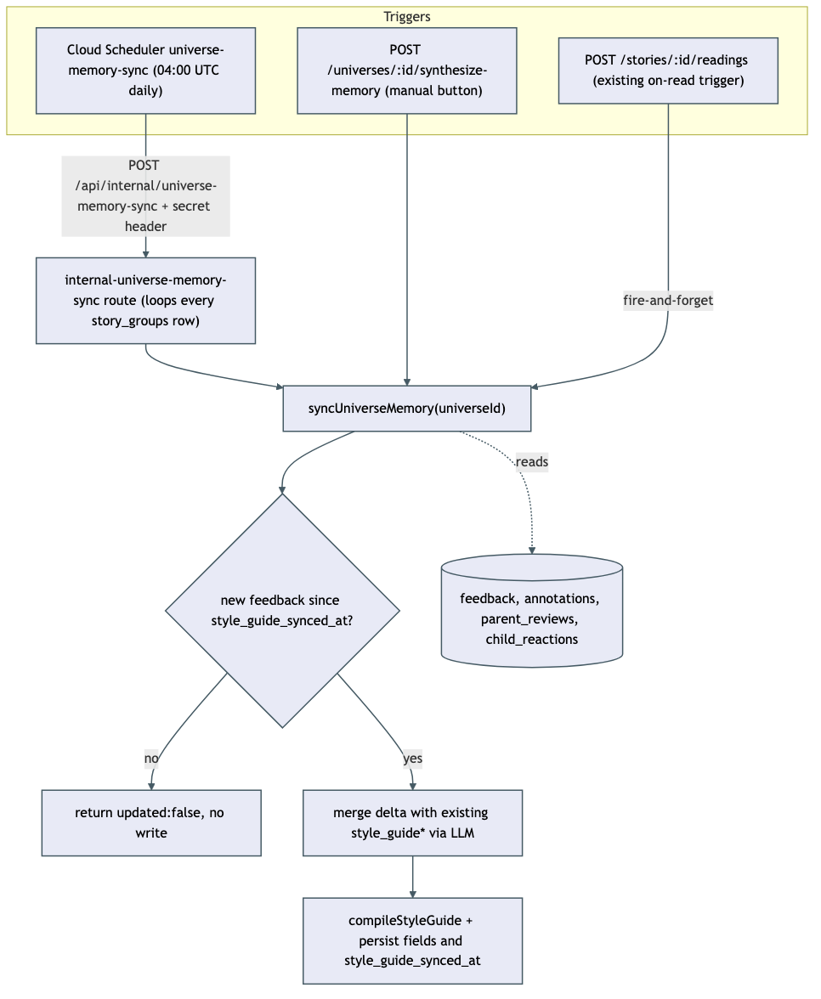
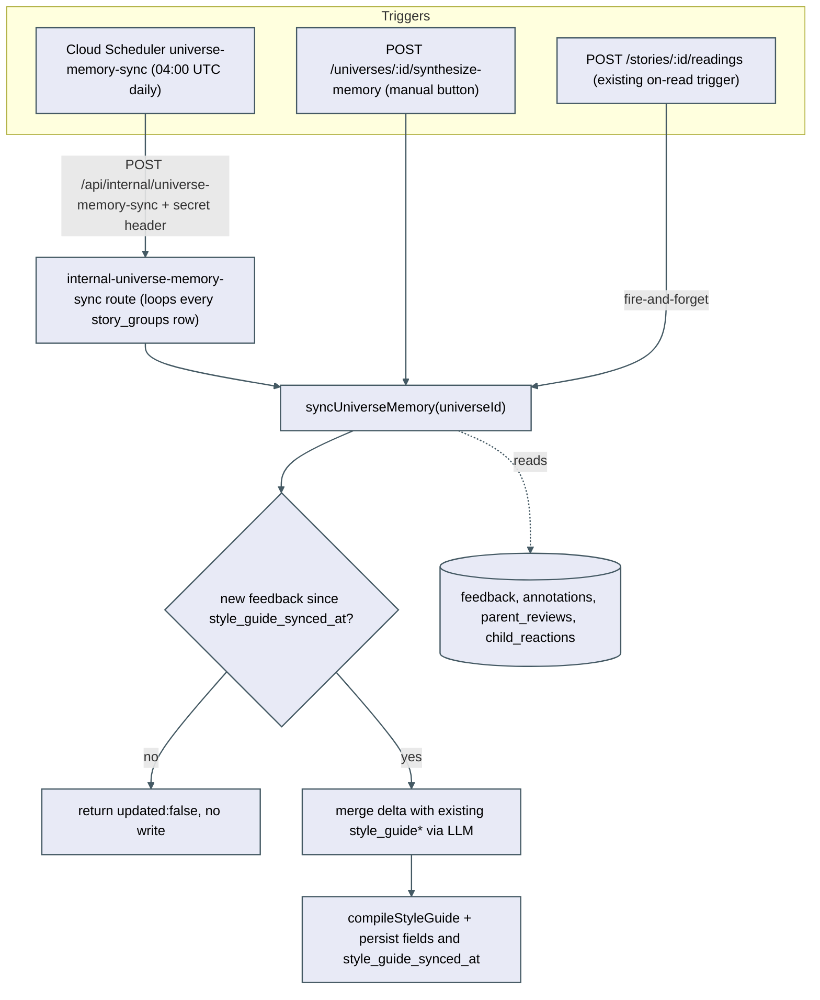

# Universe memory nightly sync

`syncUniverseMemory(universeId)` in `packages/core/src/pipeline/synthesize-universe-memory.ts` is the single accumulating write path for a universe's `story_groups.style_guide*` fields. Three separate triggers all call the same function instead of each doing its own read-then-overwrite, which is what makes every trigger accumulate rather than reset the memory.

## Triggers

1. **Cloud Scheduler `universe-memory-sync`** — runs daily at 04:00 UTC (one hour after `catalog-sync`), POSTs to `/api/internal/universe-memory-sync` with the `X-Universe-Memory-Sync-Secret` header. The route loops over every `story_groups` row and calls `syncUniverseMemory` for each, in-process, one universe's failure logged and skipped without aborting the batch.
2. **Manual regenerate button** — `POST /universes/:id/synthesize-memory` calls the same function for one universe on demand.
3. **On-read trigger** — marking a story `read` (`POST /stories/:id/readings`) fires the same function in the background (fire-and-forget) for that story's universe.

## What the function does

1. Reads the universe's current `style_guide_synced_at` cursor.
2. Pulls the bounded window of stories (last 50 `ready`/`read`, unchanged from before this feature) plus everything from `feedback`, `annotations`, `parent_reviews`, and `child_reactions` created after the cursor — or everything in the window if the cursor is `null` (first-ever sync for that universe).
3. If that delta is empty, returns `{ updated: false }` without calling the LLM or writing anything. This applies whether the cursor was already set (a true no-op night) or still `null` (a universe with no feedback yet).
4. Otherwise asks the LLM to merge the delta into the universe's existing `works` / `doesntWork` / `techniques` / `minimize` sections (distill, don't append — same length caps `style-guide-updater.ts` already enforces: works ≤10 lines, doesntWork ≤6, minimize ≤5), compiles the merged sections with the existing `compileStyleGuide` deriver, and persists the four section fields + the compiled `style_guide` + a refreshed `style_guide_synced_at` in one single `UPDATE` statement.

## Notes and known limitations

- `updateStyleGuide` (`style-guide-updater.ts`) is a separate accumulator that runs on legacy-story approval, driven by structured story-analysis output rather than raw feedback rows. It is not unified with `syncUniverseMemory` — both merge rather than overwrite, so two writers touching the same row is an accepted last-write-wins interleaving, not a data-loss bug.
- No distributed lock protects concurrent writers to the same universe (e.g. the nightly job and a manual click close together). Each run's persistence is a single-statement update of all fields together, so the outcome is "last commit's merge wins" — never a corrupted mix of one run's sections with another run's timestamp.
- Feedback left on a story outside the 50-most-recent-stories window is invisible to synthesis — a pre-existing limitation carried forward unchanged.
